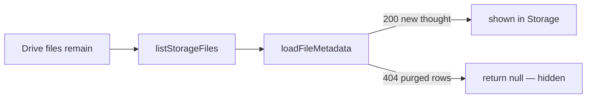

# Diagnostic: Storage disappearance of old thoughts + new thought feed visibility

Date: 2026-08-09. Read-only diagnostic. No source files were changed. No Drive deletes. No deploy.

Findings labelled **OBSERVED** or **INFERRED** per `.cursor/rules/diagnostic-discipline.mdc` §6.

---

## Summary

| Symptom | Root | Verdict |
|---|---|---|
| **A** — Storage modal only shows the newest thought; older ones “gone” but still in Google Drive | Storage joins Drive list → `metadata-index`; on **404** thought thumbs are **discarded** (`return null`) | **Confirmed** (code + live 404/200) |
| **B** — New thought missing from Discovery feed | After hard refresh, list/decrypt/render pipeline is healthy for `1YK6tjt…` | **Not reproduced at API/decrypt boundary**; if UI still empty, treat as wrong surface or stale client cache |

Drive was **never** deleted by the public-index purge. Postgres public rows without `publicContentRef` were deleted; Storage then hid orphans.

---

## Symptom A — Storage only shows the new thought

### Mechanism (H-S1) — confirmed

**OBSERVED in code** — [`useLoadFilesForAccount.ts`](apps/aggregator-browser/src/hooks/useLoadFilesForAccount.ts) ~168–171:

```ts
const thumbMetadata = await loadFileMetadata(thumb.id);
if (!thumbMetadata) {
  return null; // filtered out of Storage list
}
```

**OBSERVED in code** — [`FileStorageAggregator.tsx`](apps/aggregator-browser/src/components/FileStorageAggregator.tsx) `loadFileMetadata`: `GET /api/aggregator/metadata-index/:id` status **404** → add to `metadataMissingIdsRef` → return `null`.

**OBSERVED live (2026-08-09):**

| fileId | `GET …/metadata-index/:id` |
|---|---|
| `1JwC5G8FahPMKU0pIBoxTdAZ6K1DVFBhV` (old) | **404** `{"error":"File not found in index"}` |
| `1YK6tjtFRAcZmd6KTKdVyc0xqnCNOYXg-` (new) | **200** with `thought.content: "test"`, `publicContentRef`, `publicToken.shareKey` |

**INFERRED:** Phase 4 `purgePublicRowsMissingContentRef` removed public Postgres rows lacking `publicContentRef` (see [`aggregatorMetadataServiceDB.ts`](api/src/server/modules/aggregatorMetadataServiceDB.ts) ~440–456). That DELETE targets Postgres only — not Google Drive.

**User OBSERVED:** old files still visible when opening Google Drive directly.



### H-S2 — Drive list omits old files

**Not live-verified** (requires authenticated `GET /api/drive/files` + session). Secondary.

**Falsifier status:** If Network later shows `drive/files` already missing old ids while Drive UI still has them in the pN folder, escalate to folder query in [`driveRoutes.ts`](api/src/server/modules/driveRoutes.ts). Given user Drive visibility + H-S1 code path + old index 404, **H-S1 alone explains the Storage UI symptom** even when Drive list still returns the files.

---

## Symptom B — New thought feed visibility

Target id: `1YK6tjtFRAcZmd6KTKdVyc0xqnCNOYXg-`.

### Already established (publish write path)

**OBSERVED:** single-file inspect / metadata GET: `exists`/`isPublic`, `publicContentRef`, tokens, content `"test"`, `fileType: thought-thumbnail`, `name: thumb_thought-…`.

### H1 — Discovery TTL / no forceRefresh

**OBSERVED live:** `GET /api/aggregator/metadata-index?contentClass=thought&limit=50` → **200**, `totalFiles: 1`, files include `1YK6tjt…`. Old id absent from list (expected after purge).

**Verdict:** H1 **falsified** as root of ongoing absence after hard refresh (API list has the file). H1 can still cause a **≤60s** stale view right after publish ([`CentralMetadataAggregator`](apps/aggregator-browser/src/services/storage/CentralMetadataAggregator.ts) `TTL_MS = 60_000`) if upload does not `forceRefresh`.

### H2 — Client strips `thumb_*` thought payload

**OBSERVED in code** — [`MetadataIndexService.ts`](apps/aggregator-browser/src/services/metadata/MetadataIndexService.ts) ~87–121: when `name` starts with `thumb_`, mapped `thought`/`textPost` are set to `undefined`.

**OBSERVED via simulation on live list entry:** after strip, file **remains** in list; `publicToken` preserved; `fileType` stays `thought-thumbnail`; collection exclude filter does **not** drop it.

**OBSERVED in code** — FullScreenFeed comment: thoughts are rendered as thumbnail images, not from `thought` text fields.

**Verdict:** H2 **falsified** for “missing from list / missing tile.” Residual defect: thought/textPost stripped on every discovery load (info UX / overlays), not tile membership.

### H3 — `public-content` fails

**OBSERVED live:**

- `GET /api/aggregator/public-content/1YK6tjt…` → **200** in ~2.8s, body `{ encrypted, iv, salt }` (~59KB encrypted).
- AES-GCM decrypt with `publicToken.shareKey` → **DECRYPT_OK**, PNG magic `89504e47…`, size 44489 bytes.

**Verdict:** H3 **falsified**.

### H4 — Wrong surface

**INFERRED:** Storage (Symptom A) can look like “my thought disappeared” while Discovery/public feed still has the new indexed row. Default home feed id in App is `public` (includes thoughts). `activeFeedId === 'discovery'` returns `[]` in [`useFeedFiltering`](apps/aggregator-browser/src/hooks/useFeedFiltering.ts) — only relevant if that tab is selected.

### Render path

**OBSERVED in code:** DiscoveryPage / FullScreenFeed load `thumb_*` via `decryptPublicFeedMedia`; permanent failures go to `failedThumbnails` → “Unavailable”; success shows ``. No filter excludes `thought-thumbnail` from public/thoughts feeds.

**Verdict:** With list membership + decrypt OK, no render filter should drop the new thought after a fresh discovery load. Browser UI session was **not** unlocked in this diagnostic; UI pixel confirmation remains user-side.

---

## Drive vs index (explicit)

| Layer | Old thought(s) purged from public index | New thought `1YK6tjt…` |
|---|---|---|
| Google Drive | **Untouched** by purge | Present (envelope + indexed thumb) |
| Postgres public index | Row(s) **deleted** (`purgePublicRowsMissingContentRef`) | Present |
| Storage modal | Hidden via metadata-null filter | Shown (has index row) |
| Public thought list | Absent | Present (only thought in list at probe time) |
| `public-content` | N/A (no index row) | 200 + decryptable PNG |

Console 404s on old ids in Storage are the join failing — not Drive deletion.

---

## Hypothesis scorecard

| ID | Claim | Result |
|---|---|---|
| H-S1 | Metadata null → Storage hides thought | **Confirmed** |
| H-S2 | Drive list API omits old files | **Unverified** (no auth session); secondary |
| H1 | Stale TTL hides new thought after refresh | **Falsified** for post-refresh; residual race ≤60s pre-refresh |
| H2 | Client strip removes thought from list | **Falsified** for membership; strip still clears thought fields |
| H3 | public-content/decrypt fails | **Falsified** |
| H4 | Wrong surface (Storage vs feed) | **Plausible** for “I don’t see it” reports tied to Storage |

---

## Correction list (build plan next — not done here)

Ordered by user-visible impact:

1. **Storage must not drop Drive-owned thoughts when public-index is missing.** Show orphan Drive files (private/unindexed) with limited actions; do not `return null` solely because `metadata-index` 404s. Optionally load private/owner metadata if a path exists.
2. **Do not treat public-index purge as user-visible deletion** without a Storage UX that still lists Drive orphans (or a re-index/repair flow for recoverable envelopes).
3. **Optional repair:** re-publish / re-index orphan Drive thoughts that still have readable public envelopes + share material — only if product wants them public again.
4. **Discovery:** on successful publish, `discoverFiles(..., forceRefresh: true)` (or invalidate TTL) to avoid ≤60s stale empty list.
5. **Stop stripping `thought`/`textPost` from `thumb_thought-*` rows** in MetadataIndexService if any UI still needs those fields (tile path does not).

---

## Out of scope (this run)

No code fixes, no Drive deletes, no re-publish, no deploy. Follow-up: build plan for Storage orphan listing + publish cache invalidation.
