# Ecosystem modularity map + unlock latency findings

**Status:** Plan #2 Waves A–E implemented (2026-09-14). Debt register below marked closed where deleted+rebuilt.  
**Date:** 2026-09-14  
**Invariant:** Every concern is **shared** (spine import) or **app-specific** (surface UI). Anything else is **debt** (delete + rebuild).

---

## 1. Executive verdict

| Hypothesis | Outcome | Observation |
|---|---|---|
| Unlock/first-useful latency is dominated by post-PoW network orchestration, not identity crypto | **Confirmed** | Browse unlock awaits messaging handoff (up to 20s) + `runUnlockPostPrefetch` before `setUnlocked`; then vault hydrate + AT mint; inbox awaits full mailbox drain + Sheets + per-row profiles. User-reported ~15s “auth” and ~30s inbox match this stack, not PBKDF2 alone. |
| Bottlenecks are mostly cross-layer / duplicate debt, not missing capability | **Confirmed** | Shared packages already own crypto, cloud headers, mailbox helpers, OAuth chrome. Apps re-wrap waiters, fork EncryptionManager, triplicate L5 session resume, and gate UX on durable SoT. |

**System-wide:** Plan #2 closed unlock/messaging orchestration (D1–D8) and L5/first-party hosts. Plan #3 closed D14/D20/D21 (shared unlock mint, developer-portal off identity-sdk, migrate on forwarded cloud AT).

Latency pain is **traceable to named debt rows** in §3 (D1–D12 especially).

---

## 2. Spine catalog v1

Canonical shared owners. Apps may only **import and wire**; they must not reimplement.

| Concern | Canonical owner | Allowed app usage |
|---|---|---|
| Identity create / unlock | `@par-noir/identity-crypto` | Call create/unlock; no local EncryptionManager fork |
| OAuth unlock proofs (ML-DSA) | `@par-noir/pqc-crypto` | Sign proofs in OAuth authenticate |
| DMs / group message crypto | `@par-noir/dm-crypto` | Encrypt/decrypt; **`DmThreadSession`** is the only per-connection SoT (root, peer route, paint decrypt) |
| Feed / public share domain | `@par-noir/aggregator-domain` | Types + public decrypt helpers |
| OAuth UI / handoff / CloudReconnect | `@par-noir/oauth-ui` | UnlockButton, popup, resume snapshot, `FirstPartyCloudReconnectHost`, `ThirdPartyCloudReconnectHost`, portal session helpers, pending grant |
| Device cloud credentials / mailbox / outbox / owner headers | `@par-noir/device-cloud-credentials` | Single waiter `waitForCloudCredentialsReady`; `ownerCloudHeadersAsync`; `requireOnlineCloudForSend`; promote/pending/ack |
| User-owned storage types/creds | `@par-noir/user-owned-storage` | Envelope types; no second token rules |
| Device client / auth | `@par-noir/device-client`, `@par-noir/device-auth` | Registry, proofs, local device registration |
| Messaging UI primitives | `@par-noir/messaging-ui` | Channel constants, handoff message types, shared chrome |
| Recovery crypto | `@par-noir/recovery-crypto` | Shamir/vault crypto only; API wiring in dashboard |
| Standard data points / ZKP | `@par-noir/standard-data-points`, `zk-protocol-v1/v2` | Verification levels, proofs |
| Identity / storage migration | `@par-noir/identity-migration`, `@par-noir/storage-migration` | Orchestration packages; app = UI |
| Desktop IPC contracts | `@par-noir/desktop-ipc` | Electron preload/main channels |
| Drive token resolution (API) | `api/.../ownerDriveToken.ts` → `resolveOwnerDriveToken` only | No second server resolver |

### Machine ratchets (already encode parts of the rule)

| Script | Invariant |
|---|---|
| `scripts/check-no-identity-core-in-apps.sh` | Apps must not import `@identity-protocol/identity-core` |
| `scripts/check-legacy-identity-crypto.sh` | No RSA / app-local IdentityManager reintroduction |
| `scripts/check-token-resolver-boundary.sh` | Drive AT via `resolveOwnerDriveToken` (burn-down allowlist) |
| `scripts/check-oauth-unlock-proof-boundary.sh` | Unlock proof on OAuth mint |
| `scripts/check-no-passcode-on-oauth-wire.sh` | No passcode on authenticate wire |
| `scripts/check-l5-product-route-boundary.sh` | L5 cannot hit messages/mailbox/connections/groups product routes |
| `scripts/check-app-import-boundary.sh` | Apps do not import each other |
| `scripts/check-owner-fetch-boundary.sh` / drive freshness / googleapis | Owner fetch + AT freshness constraints |
| `scripts/check-unlock-critical-path.sh` | No `await runUnlockPostPrefetch` / no 20s handoff before unlock |
| `scripts/check-messaging-list-no-await-drain.sh` | List hosts must not `await drainSocialMailbox` |
| `scripts/check-route-manifest.sh` | Live/Removed/410 rows in ROUTE_MANIFEST match API mounts |

**Allowlist debt (entries only ever removed):** token-resolver (**empty**), peer-credential (**empty** — migrate on forwarded AT), oauth-unlock-proof / passcode-wire / googleapis-resolver (burn-down continues separately).

### Missing spine (repeated in ≥2 apps, no single package export)

| Concern | Status |
|---|---|
| L5 OAuth session helpers | **Closed** — `portalOAuthSession` in oauth-ui |
| `oauthStatesMatch` | **Closed** — export from oauth-ui |
| First-party CloudReconnect host | **Closed** — `FirstPartyCloudReconnectHost` |
| Online-cloud-required-for-send | **Closed** — `requireOnlineCloudForSend` |
| Owner Drive fetch wrapper | Open / optional — prefer package next to headers |
| `parNoirOAuthInline` shared mint (D14) | **Closed** — oauth-ui unlock-proof mint |
| Developer-portal identity-sdk (D20) | **Closed** — portal helpers only |

---

## 3. Debt register (blast radius order)

| ID | Concern | Status | Notes |
|---|---|---|---|
| ~~D1~~ | Prefetch before `setUnlocked` | **closed** | `void runUnlockPostPrefetch` after unlock |
| ~~D2~~ | 20s messaging handoff gate | **closed** | 3s bound + toast |
| ~~D3~~ | Drain before list paint | **closed** | Background `requestHotDrain`; ratchet |
| ~~D4~~ | Promote inside drain | **closed** | Promote on send / single post-unlock owner |
| ~~D5~~ | `cloudUnlockCoordinator` | **closed** | Deleted; package waiter only |
| ~~D6~~ | Double cloud wait on messageFetch | **closed** | `ownerCloudHeadersAsync` only |
| ~~D7~~ | `grp_*` profile N+1 | **closed** | Skip in `loadDisplayNames` |
| ~~D8~~ | Sheets reload blocks open thread | **closed** | Fire-and-forget reconcile |
| ~~D9~~ | Browser EncryptionManager fork | **closed** | Import `@par-noir/identity-crypto` |
| ~~D10~~ | L5 session helpers | **closed** | `portalOAuthSession` in oauth-ui |
| ~~D11~~ | `oauthStatesMatch` copies | **closed** | Export from oauth-ui |
| ~~D12~~ | Dashboard local cloudTokenHeaders | **closed** | `ownerCloudHeadersAsync` |
| ~~D13~~ | First-party CloudReconnect dup | **closed** | `FirstPartyCloudReconnectHost` + thin mounts |
| ~~D14~~ | `parNoirOAuthInline` parallel mint | **closed** | `mintAccessTokenWithUnlockProof` in oauth-ui |
| ~~D15~~ | Dashboard crypto re-export shims | **closed** | Deleted; package imports |
| ~~D16~~ | Dual OAuth callback inflight | **closed** | `oauthSessionCoordinator` only |
| ~~D17~~ | Dup `requireOnlineCloudForSend` | **closed** | Package export |
| ~~D18~~ | Unwired keychain cloud-cred APIs | **closed** | Deleted (re-add only as CredentialStore adapter) |
| ~~D19~~ | Desktop Header raw `pnName` | **closed** | Nickname / non-sensitive label only |
| ~~D20~~ | Developer-portal identity-sdk | **closed** | Portal session on oauth-ui; dep removed |
| ~~D21~~ | Peer-credential allowlist | **closed** | Migrate on `resolveOwnerDriveToken`; allowlist empty |
| ~~D22~~ | Triple promote waves | **closed** | Single post-unlock promote owner |

### Route burn-down (Wave E)

| Path | Action |
|---|---|
| `GET /oauth/popup-bridge` | **Deleted** (was 410) |
| `POST /api/recovery/requests/:requestId/shares` | **Deleted** (was 410) |
| `POST /api/auth/challenge` | **Deleted** |
| `POST /api/auth/verify` | **Deleted** (was 410) |
| `GET /api/messages/conversation` | **Deleted**; clients use `POST` only |
| `POST/DELETE /api/feeds/:feedId/subscriptions`, `POST /api/subscriptions/confirm` | **Kept** as intentional **410** tombstones (documented) |

Ratchet: `scripts/check-route-manifest.sh` (+ husky/CI).

### Plan #3 closeout (D14 / D20 / D21)

| Item | Action |
|---|---|
| D14 | Unlock-proof mint in `@par-noir/oauth-ui` (`mintAccessTokenWithUnlockProof`); dashboard decrypt-only wrapper; browse dead `authenticate`/`completeAuthFlow` deleted |
| D20 | Developer-portal off `@identity-protocol/identity-sdk`; `fetchPortalUserInfo` / `revokePortalToken`; ratchet extended |
| D21 | Migrate Drive routes on `resolveOwnerDriveToken` + client `ownerFetch`; peer-credential allowlist **empty** |

### Messaging session spine rebuild (2026-09-14)

| Item | Action |
|---|---|
| Soft Accept | **Fail-closed** — `connection_accept` mailbox must deliver or Accept returns 409; client surfaces unfinished |
| Multi-writer paint | **Deleted** peer-default inbound preview Message rows; wake-only + Sheets SoT via `DmThreadSession` |
| Session SoT | `@par-noir/dm-crypto` `DmThreadSession` (root, peer route, encrypt/decrypt-or-fail) |
| QA | Force-wipe DMs/groups/connections; gate **A→B and B→A** |

---

## 4. Per-app concern matrices

Tags: **shared** | **app-specific** | **debt**.

### 4.1 id-dashboard (L2)

| Concern | Tag | Evidence | Notes |
|---|---|---|---|
| Identity create/unlock | shared | `useAuthUnlockHandlers`, IdentityCrypto | `@par-noir/identity-crypto` |
| Device cloud store + migrate/flush | shared | `deviceCloudCredentials.ts` | Adapter over package |
| Owner API cloud headers | shared | `ownerCloudHeadersAsync` | D12 closed |
| Cloud session bootstrap / accounts warm | app-specific | `cloudSessionBootstrap.ts` | L2 Storage warm |
| CloudReconnectHost | shared + app slots | Thin mount over `FirstPartyCloudReconnectHost` | D13 closed |
| parNoirOAuthInline | shared | Thin decrypt + oauth-ui mint | D14 closed |
| Deprecated crypto re-exports | shared | Direct package imports | D15 closed |
| Recovery crypto | shared | recovery-* + recovery-crypto | |
| Recovery API/session UI | app-specific | recoveryApiService, contexts | |
| GoogleDriveBackend direct Google | app-specific | Allowed L2 only | Must not copy to browser |
| Drive hydration / layout init | shared + app-specific | Hooks over package; layout UI local | Layout can block Drive tools (latency) |
| Feed/metadata/monetization/Veriff | app-specific | L2 product; Veriff out of MVP | |
| Desktop secure folder bridge | app-specific | `parNoirDesktop` | |

### 4.2 aggregator-browser — browse + messaging (L4)

| Concern | Tag | Evidence | Notes |
|---|---|---|---|
| OAuth proofs / popup chrome | shared | pnOAuthService, oauth-ui | |
| completeOAuthUnlock / bootstrap | shared | oauthSessionCoordinator, unlockBootstrap | Coalesce good; still serial before unlock |
| Prefetch before setUnlocked | shared (closed) | fire-and-forget prefetch | D1 closed |
| Messaging handoff gate | shared (closed) | 3s fail-fast | D2 closed |
| cloudUnlockCoordinator | shared (closed) | deleted | D5 closed |
| AggregatorCloudReconnectHost | shared + app slots | Thin mount over FirstParty host | D13 closed |
| ownerApiHeaders / ownerApiFetch | shared | | D6 closed |
| Mailbox drain consumer | shared | Drain background; no list await | D3, D4 closed |
| Inbound preview / socket paint | app-specific | inboundMailboxPreview, realtimeSync | Good pattern; don’t re-gate on Sheets |
| MessageList profile N+1 | shared (closed) | Skip `grp_*` | D7 closed |
| MessageThread drain→Sheets | shared (closed) | Async reconcile | D8 closed |
| dmCryptoClient / groupCryptoClient | shared | dm-crypto | |
| Local EncryptionManager fork | shared (closed) | identity-crypto | D9 closed |
| Feeds / discovery / upload UI | app-specific | | MESSAGING_ONLY skips some bootstrap |
| Realtime Socket.IO bus | app-specific | | |
| UserState prefs wait on cloud | shared-but-misused-as-gate | UserStateContext | Prefer non-blocking prefs |

### 4.3 prism (L5)

| Concern | Tag | Evidence | Notes |
|---|---|---|---|
| Unlock/Lock + ThirdPartyCloudReconnectHost | shared | oauth-ui | |
| ownerCloudHeadersAsync | shared | prismApi | |
| Auth session/resume | shared | portalOAuthSession helpers | D10 closed |
| oauthStatesMatch local | shared | oauth-ui export | D11 closed |
| Ray/reputation UI | app-specific | | |
| Capacitor secure storage | app-specific | | |

### 4.4 licensing-portal (L5)

| Concern | Tag | Evidence | Notes |
|---|---|---|---|
| Unlock + CloudReconnect | shared | oauth-ui | |
| ownerCloudHeadersAsync | shared | | |
| LicensingSessionContext | shared + app UI | portalOAuthSession helpers | D10 closed |
| oauthStatesMatch | shared | oauth-ui export | D11 closed |
| Track library UI | app-specific | | |
| Client id config | app-specific | | |

### 4.5 developer-portal (L5)

| Concern | Tag | Evidence | Notes |
|---|---|---|---|
| Unlock + CloudReconnect | shared | oauth-ui | |
| ownerCloudHeadersAsync | shared | | |
| PortalContext session | shared | oauth-ui portal helpers | D10/D20 closed |
| identity-sdk OAuth client | shared (closed) | Dep removed from portal app | D20 closed |
| oauthStatesMatch | shared | oauth-ui export | D11 closed |
| Credentials/docs/API keys UI | app-specific | | |

### 4.6 desktop-dashboard

| Concern | Tag | Evidence | Notes |
|---|---|---|---|
| Embed id-dashboard App | app-specific | AppMain | Correct thin shell |
| Secure volume / VeraCrypt / hdiutil | app-specific | secureVolume/* | Desktop-only |
| Keychain token for volume | app-specific | TokenStorageService | Not Drive AT resolver |
| Keychain cloud cred store unwired | shared (closed) | Deleted unwired APIs | D18 closed |
| desktop-ipc | shared | package | |
| Header pnName display | shared (closed) | Nickname only | D19 closed |

### 4.7 api (L3 boundary)

| Concern | Tag | Notes |
|---|---|---|
| resolveOwnerDriveToken | shared | Single resolver; allowlist = debt burn-down |
| Opaque mailbox / messages routes | shared | Coordinator; must not decrypt |
| L5 product route boundary | shared | Enforced by check script |
| Peer-credential allowlist paths | shared (closed) | Empty; migrate uses forwarded AT |

Apps must not reimplement server Drive token logic client-side beyond forwarding `X-PN-Cloud-Access-Token`.

---

## 5. Unlock → first-useful latency appendix

### Intended layer contract (rebuild target)

```text
L1 PoW complete → keys in memory
L3 session mint (OAuth or dashboard JWT) → UI may unlock
L2 cloud AT hydrate → background; Drive-backed calls wait at call site, not shell
L4 inbox/thread → cache/session first; drain/Sheets background
L5 shell → unlock when OAuth session ready; CloudReconnect only for owner Drive actions
```

### Observed critical paths

```mermaid
flowchart LR
  pow[Identity_PoW]
  session[Session_mint]
  handoff[Messaging_handoff]
  prefetch[Post_unlock_prefetch]
  uiUnlock[UI_unlocked]
  vault[Vault_hydrate_AT_mint]
  drain[Mailbox_drain_promote]
  sheets[Sheets_conversations]
  profiles[Profile_N_plus_1]
  useful[First_useful_screen]
  pow --> session --> handoff --> prefetch --> uiUnlock --> vault --> drain --> sheets --> profiles --> useful
```



| Surface | First useful moment | What blocks it today | Primary debt IDs |
|---|---|---|---|
| Messaging | Inbox rows visible | Unlock serial handoff+prefetch; then vault; then await drain; Sheets list; profile GETs for every `grp_*` | D1–D7, D22 |
| Messaging | Open chat messages | Sheets conversation GET + decrypt; optional drain+reload after realtime | D8 |
| Browse | Feed/me usable | Same unlock + vault; plus feeds/aggregator/layout noise | D1, D5, D13 |
| Dashboard | Identity shell | Local PoW — relatively clean | — |
| Dashboard | Drive tools usable | migrate/flush + CloudReconnect + layout init | D12, D13, D22 |
| Prism / licensing / developer | Shell unlocked | OAuth exchange + getUserInfo (usually fine) | D10 mild |
| L5 | Drive-backed action | ThirdPartyCloudReconnectHost hydrate + AT | Shared wait (legit at call site) |

### Observed vs inferred (user console / prior QA)

- **Observed (user console on browse, pn-87f49f0fb345):** Repeated `layout/status`, `mailbox/route`, `mailbox/lookup` (incl. `notification_row`), `mailbox/pending`, `messages/conversations`, many `profile/grp_*`, `apply-inbound`, `mailbox/enqueue`. Matches D3–D7, D4 promote/lookup storm, QA group litter.
- **Observed (prior QA):** Open-thread receive ~553ms with socket ciphertext — proves crypto+wire can be fast; **does not** falsify cold inbox debt.
- **Inferred:** ~15s “auth” ≈ handoff + bootstrap + prefetch + vault, not PoW alone. ~30s inbox ≈ drain/promote + Sheets + N profiles.

### Falsification notes

- If a surface reached usable UI within ~2s after PoW with no Drive wait on the shell path, latency hypothesis would fail for that surface. **L5 shells** are closest; **messaging inbox** is farthest.
- Architecture hypothesis would fail if waits were single-owner with no duplicate coordinators. **Falsified** by D5, D10, D13, D16, D22.

---

## 6. How modularity broke (short)

1. Spine packages were added correctly for crypto and custody primitives.
2. Each product feature then added an **app-local coordinator/await** so durable correctness could not race — and those awaits were hung on **user-visible** unlock/list/open.
3. L5 copied session resume instead of extending oauth-ui once.
4. Browser forked EncryptionManager “to match dashboard” instead of importing identity-crypto.
5. Narrow wins (e.g. socket ciphertext paint) improved one path without deleting drain-as-gate / prefetch-before-unlock — classic patch stacking.

---

## 7. Plan #2 rebuild workstreams (no patches)

Order: **spine first**, then thin app wires. Reject any task that adds a second waiter, shim, or dual path.

### Wave A — Unlock contract (latency + modularity)

1. **UI unlock after session + messaging keys**; do not `await runUnlockPostPrefetch` (D1).
2. **Handoff:** bounded fail-fast; do not hold shell for 20s (D2).
3. **Delete `cloudUnlockCoordinator`**; single package waiter (D5).
4. **Ratchet:** test or script fails if unlock path awaits prefetch/drain before `setUnlocked`.

### Wave B — Messaging UX critical path

1. MessageList/Connections/Requests: **paint without awaiting drain** (D3).
2. Decouple **promote** from drain-before-read (D4, D22).
3. Skip profile fetch for `grp_*`; use `groupTitle` (D7).
4. Open thread: session/cache first; Sheets reconcile background (D8).
5. Collapse double cloud wait on messageFetch (D6).
6. Ratchet: MessageList must not `await drainSocialMailbox` before first paint.

### Wave C — Shared hosts / L5 session

1. Export `oauthStatesMatch`; shared L5 portal session helper (D10, D11).
2. Converge first-party CloudReconnect into oauth-ui (D13).
3. Dashboard owner headers → `ownerCloudHeadersAsync` only (D12).
4. Developer-portal: leave identity-sdk only if tracked in NEEDS_USER_REVIEW burn-down (D20).

### Wave D — Crypto / cleanup

1. Delete browser EncryptionManager fork; import identity-crypto (D9).
2. Delete dashboard deprecated crypto re-exports (D15).
3. One `requireOnlineCloudForSend` helper (D17).
4. Desktop: wire or delete keychain cloud store (D18); fix pnName display (D19).

### Wave E — API allowlist burn-down

1. Continue removing token-resolver / peer-credential allowlist entries only with real path fixes (D21). No new entries.

### Explicit non-goals for plan #2

- No new unlock/mailbox coordinators
- No “keep both paths until…”
- No Veriff/Stripe expansion
- No claiming messaging GA from unit tests alone

---

## 8. Success criteria for plan #2 (when executed)

- Debt register rows closed by **delete + spine ownership**, not new wrappers.
- Messaging: cold unlock→inbox first paint no longer awaits full drain/promote.
- Browse unlock: `setUnlocked` not blocked on prefetch.
- L5: one session helper; zero local `oauthStatesMatch`.
- Browser: zero local EncryptionManager.
- New ratchets prevent reintroduction of D1/D3/D5-class gates.

---

## 9. Source index (discovery)

- Packages under `packages/*`; how-to-build shared spine table; `scripts/check-*.sh`
- Apps: `id-dashboard`, `aggregator-browser`, `prism`, `licensing-portal`, `developer-portal`, `desktop-dashboard`
- Prior live evidence: user Network console (inbox/profile/mailbox); open-thread QA ~553ms realtime paint
