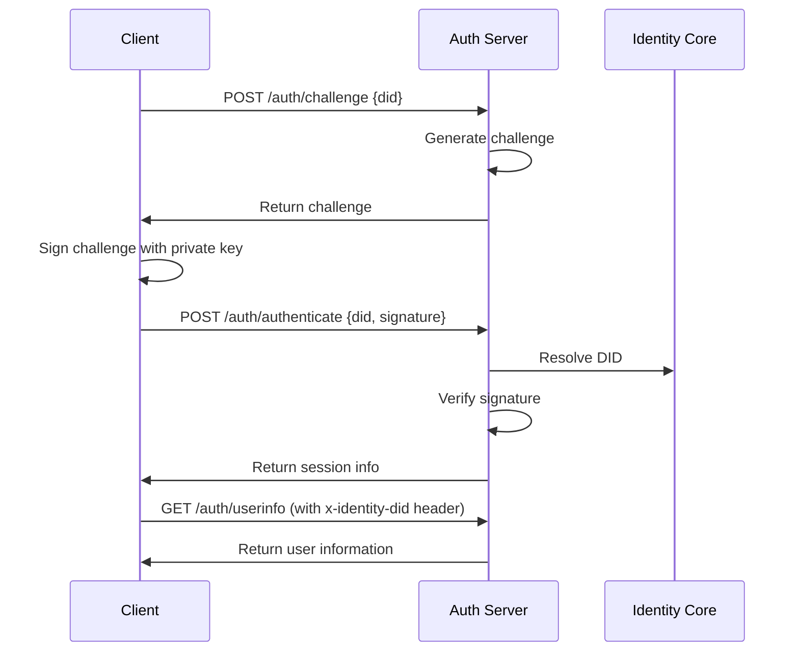

# Decentralized Authentication System

## Overview

The Identity Protocol now uses **decentralized authentication** instead of traditional OAuth 2.0. This approach eliminates the need for centralized databases while maintaining security and user control.

## Key Benefits

### ✅ True Decentralization
- **No centralized database** required for authentication
- **User controls their own authentication** using cryptographic keys
- **No OAuth server dependencies**
- **Stateless authentication** using DID-based sessions

### ✅ Enhanced Security
- **Cryptographic proof of identity** using Ed25519 signatures
- **Challenge-response authentication** prevents replay attacks
- **No token storage** - DID serves as authentication
- **Rate limiting and security monitoring**

### ✅ Developer Friendly
- **Simple API endpoints** for authentication
- **OAuth compatibility layer** for legacy support
- **WebSocket support** for real-time authentication
- **Comprehensive SDK** for easy integration

## Architecture

### Authentication Flow



### Components

1. **DecentralizedAuthServer** - Main authentication server
2. **DecentralizedAuthSDK** - Client-side SDK
3. **DecentralizedAuthManager** - Frontend state management
4. **DecentralizedAuth Component** - React UI component

## API Endpoints

### Core Authentication Endpoints

| Endpoint | Method | Description |
|----------|--------|-------------|
| `/auth/challenge` | POST | Create authentication challenge |
| `/auth/authenticate` | POST | Authenticate with signature |
| `/auth/userinfo` | GET | Get user information |
| `/auth/validate` | GET | Validate session |
| `/auth/logout` | POST | Logout and invalidate session |
| `/auth/resolve/:did` | GET | Resolve DID document |

### OAuth Compatibility Endpoints

| Endpoint | Method | Description |
|----------|--------|-------------|
| `/oauth/authorize` | GET | Redirect to decentralized auth |
| `/oauth/token` | POST | Convert to OAuth token format |
| `/oauth/userinfo` | GET | OAuth-compatible user info |

## Implementation

### 1. Server Setup

```typescript
// Start decentralized auth server
import DecentralizedAuthServer from './decentralized-auth-server';

const server = new DecentralizedAuthServer();
server.start();
```

### 2. Client Integration

```typescript
// Using the SDK
import { DecentralizedAuthSDK } from '@identity-protocol/identity-sdk';

const sdk = new DecentralizedAuthSDK({
  apiUrl: 'https://api.identityprotocol.com',
  enableWebSocket: true
});

// Authenticate with identity
const result = await sdk.authenticateWithRetry(identity);
```

### 3. React Integration

```typescript
// Using the React hook
import { useDecentralizedAuth } from './utils/decentralizedAuth';

const { isAuthenticated, authenticate, logout, getUserInfo } = useDecentralizedAuth();

// Authenticate
const success = await authenticate(identity);

// Get user info
const userInfo = getUserInfo();
```

## Security Features

### Challenge-Response Authentication

1. **Challenge Creation**: Server generates a random challenge
2. **Cryptographic Signing**: Client signs challenge with private key
3. **Signature Verification**: Server verifies using public key from DID
4. **Session Creation**: No tokens - DID serves as session identifier

### Rate Limiting

- **100 requests per 15 minutes** per IP address
- **Exponential backoff** for retry attempts
- **Challenge expiration** after 5 minutes

### Security Headers

- **Helmet.js** for security headers
- **CORS protection** with configurable origins
- **Content Security Policy** (CSP)
- **HTTP Strict Transport Security** (HSTS)

## Migration from OAuth

### Phase 1: Parallel Implementation
- Deploy decentralized auth alongside OAuth
- Update SDK to use decentralized auth by default
- Maintain OAuth compatibility layer

### Phase 2: Gradual Migration
- Update client applications to use new endpoints
- Test and validate authentication flows
- Monitor performance and security

### Phase 3: OAuth Deprecation
- Remove OAuth server dependencies
- Update documentation and examples
- Complete migration to decentralized auth

## Configuration

### Environment Variables

```bash
# Required
JWT_SECRET=your-32-character-secret-key

# Optional
PORT=3001
ALLOWED_ORIGINS=https://yourdomain.com,https://app.yourdomain.com
LOG_LEVEL=info
```

### Server Configuration

```typescript
const config = {
  port: 3001,
  corsOrigins: ['https://yourdomain.com'],
  rateLimitWindow: 15 * 60 * 1000, // 15 minutes
  rateLimitMax: 100,
  challengeExpiry: 5 * 60 * 1000, // 5 minutes
  sessionExpiry: 24 * 60 * 60 * 1000 // 24 hours
};
```

## Usage Examples

### Basic Authentication

```typescript
// 1. Create challenge
const challengeResult = await sdk.createChallenge(identity.id);
if (!challengeResult.success) {
  throw new Error('Failed to create challenge');
}

// 2. Sign challenge
const signature = await signChallenge(challengeResult.challenge, identity.privateKey);

// 3. Authenticate
const authResult = await sdk.authenticate(identity, challengeResult.challenge);
if (authResult.success) {
  console.log('Authenticated successfully!');
}
```

### Session Management

```typescript
// Validate session
const isValid = await sdk.validateSession(did);

// Get user info
const userInfo = await sdk.getUserInfo(did);

// Logout
await sdk.logout(did);
```

### React Component Usage

```tsx
import { DecentralizedAuth } from './components/DecentralizedAuth';

function App() {
  const handleAuthenticated = (identity) => {
    console.log('User authenticated:', identity);
  };

  const handleError = (error) => {
    console.error('Authentication error:', error);
  };

  return (
    <DecentralizedAuth
      onAuthenticated={handleAuthenticated}
      onError={handleError}
    />
  );
}
```

## Testing

### Start Development Server

```bash
# Start decentralized auth server
npm run auth:dev

# Start main API server (includes decentralized auth)
npm run dev
```

### Test Endpoints

```bash
# Health check
curl http://localhost:3001/health

# Create challenge
curl -X POST http://localhost:3001/auth/challenge \
  -H "Content-Type: application/json" \
  -d '{"did": "did:key:example"}'

# Authenticate (requires valid signature)
curl -X POST http://localhost:3001/auth/authenticate \
  -H "Content-Type: application/json" \
  -d '{"did": "did:key:example", "signature": {...}}'
```

## Troubleshooting

### Common Issues

1. **Challenge Creation Fails**
   - Check server logs for errors
   - Verify DID format is valid
   - Ensure rate limiting isn't exceeded

2. **Authentication Fails**
   - Verify private key is correct
   - Check signature format
   - Ensure challenge hasn't expired

3. **Session Validation Fails**
   - Check if session has expired
   - Verify DID is still valid
   - Check server connectivity

### Debug Mode

```typescript
// Enable debug logging
const sdk = new DecentralizedAuthSDK({
  apiUrl: 'http://localhost:3001',
  enableWebSocket: true,
  debug: true
});
```

## Future Enhancements

### Planned Features

1. **Multi-factor Authentication**
   - Biometric authentication
   - Hardware security modules (HSM)
   - Social recovery integration

2. **Advanced Security**
   - Zero-knowledge proofs
   - Threshold signatures
   - Quantum-resistant cryptography

3. **Performance Optimizations**
   - Connection pooling
   - Caching strategies
   - Load balancing

### Integration Opportunities

1. **Blockchain Integration**
   - Ethereum-based authentication
   - Smart contract verification
   - Cross-chain identity resolution

2. **Standards Compliance**
   - DIDComm integration
   - Verifiable Credentials
   - Decentralized Identifiers (DIDs)

## Conclusion

The decentralized authentication system provides a secure, scalable, and truly decentralized alternative to traditional OAuth 2.0. By eliminating centralized databases and using cryptographic proof of identity, users maintain complete control over their authentication while developers get a simple, powerful API for integration.

The system is production-ready and includes comprehensive security features, monitoring, and developer tools. The OAuth compatibility layer ensures smooth migration from existing systems while the new decentralized approach provides the foundation for future enhancements.
