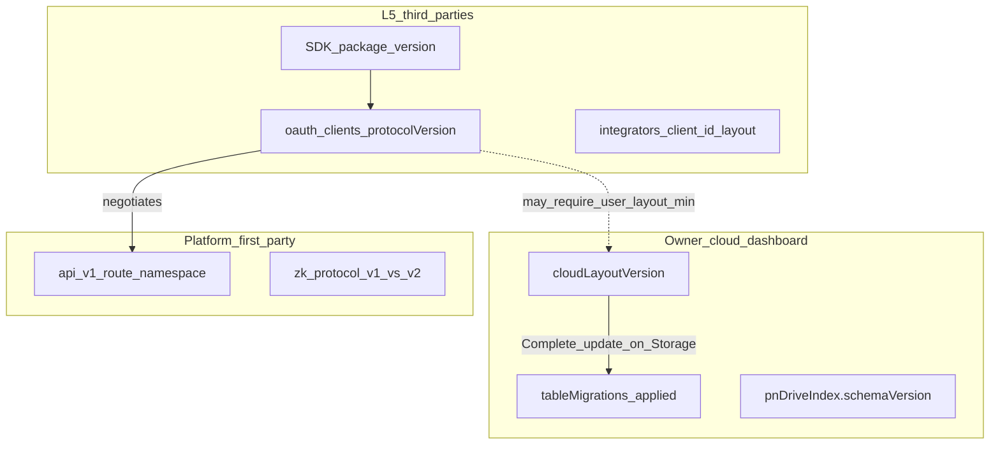

# Cloud / protocol versioning — touch-point inventory

**Status:** Inventory (ask-only). No upgrade routes or UI yet.  
**Related:** [USER_STORAGE_LAYOUT.md](./USER_STORAGE_LAYOUT.md), [DRIVE_INDEX.md](../DRIVE_INDEX.md), [STORAGE_MIGRATION.md](./STORAGE_MIGRATION.md), [ADR_MESSAGING_CHANNEL_THREADS.md](../architecture/ADR_MESSAGING_CHANNEL_THREADS.md), [ADR_DEVICE_CLOUD_CUSTODY.md](../architecture/ADR_DEVICE_CLOUD_CUSTODY.md), [PLAN_OWNER_CLOUD_LAYOUT_UPGRADE.md](../architecture/PLAN_OWNER_CLOUD_LAYOUT_UPGRADE.md).

Goal: name every surface that must participate when we add **versioning**, **version history**, and **third-party version pins**, so implementation stays grounded.

## Version domains (keep separate)

Do not collapse these into one number. Different actors own different upgrades.

| Domain | Who upgrades | How |
|--------|--------------|-----|
| **A. Owner cloud layout** | End user on dashboard (custody token) | Storage → Complete update |
| **B. Table / Inbox schema** | Same as A (additive migrations) | Catalog step under A |
| **C. Platform API** | Operators ship `/api/v1` → `/api/v2` | Path or header negotiation |
| **D. L5 client protocol pin** | Third-party updates registration / SDK | Declare supported version |
| **E. ZK proof format** | Already dual-package | Model for D |

Today only **E** and a static **C** (`/api/v1`) exist. **A/B** are ad hoc ensures. **D** does not exist (`oauth_clients` has no version column).

Under **device cloud custody**, the API cannot silently push layout changes. Upgrades need an unlocked dashboard (or equivalent) forwarding `X-PN-Cloud-Access-Token`.

---

## A. Owner cloud layout — definitions

| Touch point | Path | Role today |
|-------------|------|------------|
| Logical paths | `packages/user-owned-storage/src/pnLayout.ts` | `TABLE_PATHS`, `MESSAGES_DIR`, `integratorPath`, etc. |
| Drive index SoT | `api/src/server/modules/pnDriveIndex.ts` | `PN_DRIVE_INDEX_SCHEMA_VERSION = 1`, `REQUIRED_PN_DRIVE_SHEET_KEYS`, `isPnDriveIndexComplete` |
| Full Google init | `api/src/server/modules/pnDriveInit.ts`, `driveInitSteps.ts` | Find-or-create entire tree; sole writer of complete index |
| Init race guard | `api/src/server/modules/driveInitCoordinator.ts` | `runDriveInitOnce` |
| Folder helpers | `api/src/server/modules/pnDriveLayout.ts` | `findOrCreateFolderUnderParent` (TOCTOU duplicate risk if concurrent) |
| Portable tables | `api/src/server/modules/storage/storageInitService.ts` | `PORTABLE_TABLES`, `initializePortableStorage` |
| Provider migrate catalog | `packages/storage-migration/src/migrationCatalog.ts` | Social-cloud / file moves — **not** layout version bumps |
| Docs | `docs/developer/USER_STORAGE_LAYOUT.md`, `GOOGLE_DRIVE_STRUCTURE.md`, `docs/DRIVE_INDEX.md` | Layout contracts |

**`PnDriveIndex` fields (schemaVersion 1):** `pnFolderId`, `metadataFolderId`, `integratorsRootId`, `messagesFolderId`, `inboxSheetId`, optional `zkpDocsFolderId`, `sheetIds`, `conversationSheets`.

**Required `sheetIds` keys** (`REQUIRED_PN_DRIVE_SHEET_KEYS`): connections, third-party-permissions, devices, groups, notifications, activity_ledger, messaging_ledger, message_requests, data-point-requests, zkp-data-points, preferences, engagement, prism_ledger, public-file-index, owner-file-index, followers, following. **`owned-assets` is optional** at completeness check (lazy + patch).

**Not in `PN_DRIVE_SHEET_KEYS`:** `recovery.xlsx`, operator `platform-registry.xlsx`, per-conversation sheets (in `conversationSheets`), content-class indexes (created at init but not stored as sheet keys).

**Gap (closed for owner A+B):** `cloudLayoutVersion` + `appliedMigrations`, `/storage/.../layout/status|upgrade`, unlock/Storage CTA, and Inbox channel migration are shipped. See [PLAN_OWNER_CLOUD_LAYOUT_UPGRADE.md](../architecture/PLAN_OWNER_CLOUD_LAYOUT_UPGRADE.md). Remaining gaps: L5 `protocolVersion` (domain D), `/api/v2` (domain C).

---

## A. Owner cloud layout — mutate / consume routes

| Route | Module | Notes |
|-------|--------|-------|
| `PUT /api/storage/credentials` | `api/src/server/modules/storage/storageCredentialsRoutes.ts` | Preserves `pnDriveIndex`; defers Drive build under custody |
| `POST /api/storage/initialize/:id` | same | Full re-init — **not** a safe upgrade path |
| `GET .../initialize/:id/status` | same | Progress only |
| `POST /api/storage/:id/zkp-docs/ensure` | same | Precedent for **targeted** ensure + `patchPnDriveIndex` |
| `POST .../portable-init` | `api/src/server/modules/storage/storageRoutes.ts` | Portable first-time |
| Social/file migrate | `api/src/server/modules/storage/migrationRoutes.ts` | Provider switch / blob move |
| Identity sheets migrate | `api/src/server/modules/identityMigrationService.ts` | Re-key — out of MVP unless asked |

**Completeness consumers (fail with incomplete index, no upgrade):** messaging/connections routes via `isPnDriveIndexComplete`, `oauthDrivePermissionContext.ts`, `deviceCapabilityService.ts`, `integratorFolderService.ts`, `recoveryDriveContext.ts`.

---

## A. Owner UI / unlock touch points

| Touch point | Path |
|-------------|------|
| POST initialize + progress | `apps/id-dashboard/src/components/storage/hooks/useDriveLayoutInit.ts` |
| After connect PUT → initialize | `useDriveStorageCredentials.ts`, `driveCredentials/driveInitDecision.ts` |
| Silent ensure on bootstrap | `apps/id-dashboard/src/services/storage/cloudSessionBootstrap.ts` (`ensureDriveLayout`) |
| Storage panel surface | `FileStorageAggregator.tsx`, `MultiCloudStoragePanel.tsx` |
| zkp-docs ensure client | `apps/id-dashboard/src/services/zkpDocsStorageService.ts` |
| Unlock / cloud ready | `CloudReconnectHost.tsx`, browser `AggregatorCloudReconnectHost.tsx` |
| Owner-index load (must not init) | `loadFiles/fetchOwnerIndex.ts` |

**Browser** does not call `/storage/initialize`; it assumes layout exists. Unlock prompt for layout drift → CTA to **dashboard Storage** (identity-direct).

---

## B. Table / Inbox schema (first real migration candidate)

Channel-thread work is mostly **schema**, not new root folders. See [ADR_MESSAGING_CHANNEL_THREADS.md](../architecture/ADR_MESSAGING_CHANNEL_THREADS.md).

| Touch point | Path | Notes |
|-------------|------|-------|
| Channel ids | `api/src/server/modules/messagingChannel.ts` | `dmInboxRowKey`, `platform` |
| Google headers + lazy column ensures | `api/src/server/modules/messageSheetsService.ts` | `ensureInboxThreadTypeColumn`, `ensureInboxWrappedRootColumn`, `ensureInboxChannelColumn`; create still seeds short A–E/F headers |
| Portable rows | `api/src/server/modules/storage/messagePortableService.ts` | `inboxRowKey` rewrite; no column migrators |
| Table schema id | `api/src/server/modules/storage/tableSchemas.ts` | `INBOX_SCHEMA` |
| Product callers | `messageRoutes.ts`, `connectionRoutes.ts`, `messagingConnectionResolver.ts`, browser messaging UI / embed | Assume `channelClientId` |

**Google Inbox columns (canonical A–I):**  
`participantPnIdentifier`, `spreadsheetId`, `connectionId`, `lastMessageAt`, `lastMessagePreview`, `kemCiphertext`, `threadType`, `wrappedMessageRootKey`, `channelClientId`

**Portable vs Google:** Google evolves via lazy header/data rewrites; portable via JSON field presence + `dmInboxRowKey`. Provider migrators in `migrationTransformers.ts` / `googlePortableMigrator.ts` copy **conversation ciphertext**, not Inbox row/channel keys.

### Other lazy mutators (catalog under B or fold into layout version)

| Mutator | Path | Effect |
|---------|------|--------|
| Conversation sheets | `messageSheetsService.createConversationSheet`; messageRoutes + `patchPnDriveIndex(conversationSheets)` | Create under `messagesFolderId` |
| Integrator silo folders | `integratorFolderService.ts` | `findOrCreateFolderUnderParent` per OAuth client (+ channel `messages/`) |
| Owned-assets sheet | `ownedAssetStorageService.loadOwnedAssetDriveBundle` | Get-or-create + patch `sheetIds.owned-assets` |
| zkp-docs folder | ensure route + optional defer in `pnDriveInit` | Folder + index patch |
| Third-party permissions | `ThirdPartyPermissionsSheetsService.ensureThirdPartyPermissionsSheet` | Name-search create if missing |
| Engagement / devices / recovery / request sheets | respective `*SheetsService.getOrCreateSpreadsheet` | Lazy get/create by name |
| Stale index clear | `ownerDriveContext`, `storageIndexRoutes`, `server.ts` | `pnDriveFoldersExistOnDrive` → `clearPnDriveIndex` |

Docs (`DRIVE_INDEX.md`) say no lazy backfill for **missing required index keys**; practice still has several name-based get-or-create paths above.

---

## C / D. Third parties — “update the version you’re on”

**Today:** identity = `client_id` + scopes + silo path. No declared protocol/layout version.

| Plug-in | Path | What to version later |
|---------|------|------------------------|
| OAuth client registry | `clientRegistration.ts`, `oauth_clients` SQL, `developerSelfServiceRoutes.ts`, developer-portal Credentials / Platform clients | `protocolVersion` / `minCloudLayoutVersion` on client |
| Token / grant | `pnOAuthService.ts` `TokenPayload`, `integratorOAuthGrants.ts` | Carry negotiated version into Drive/API calls |
| Silo paths | `integratorStoragePaths.ts`, `integratorFolderService.ts`, `integratorDriveContext.ts`, `GET /api/integrator/storage-root` | Silo subtree shape if L5 layout changes |
| Messaging channel / embed | `EmbedMessagingPage.tsx`, `channelClientId` | Embed stays `client_id`; protocol pin is registry/SDK, not query soup |
| API namespace | `/api/v1/*` in `ROUTE_MANIFEST.md`; unversioned `/api/drive/*`, `/api/integrator/*` | Real API generation bumps |
| SDK | `sdk/identity-sdk` `PnIntegratorClient`, package semver | Closest existing pin integrators already bump |
| ZK (precedent) | `@par-noir/zk-protocol-v1` / `v2` | Dual-major model for breaking protocol |
| Webhooks | `User-Agent: par-Noir-Webhook/1.0` | Outbound event schema version |
| Docs / starter | `L5_INTEGRATOR_QUICKSTART.md`, `third-party-sharing-and-L5.md`, `examples/l5-integrator-starter/` | “Supported protocol version” changelog |

L5 product routes (`/api/messages`, etc.) stay first-party-only (`l5ProductRouteBoundary.ts`). Third parties do **not** run owner layout upgrades — they declare what they support and may require the user to be on a minimum owner layout.

Scopes today: `openid`, `profile`, `cloud:app`, `zkp:*` / `data_point:*`. First-party set: `browser-app`, `messaging-app`, `prism-app`, `developer-portal` (+ env portal id) via `isFirstPartyClient`.

---

## Version history (what “history” means per domain)

| Domain | History artifact (to design in impl) |
|--------|--------------------------------------|
| Owner layout | Ordered migration ids (`inbox_channel_client_id_v1`, …) + `appliedMigrations[]` on credentials / index; human changelog for Storage UI |
| Table schemas | Same migration catalog (Google header steps vs portable key rewrite) |
| L5 protocol | Changelog in developer docs + optional `supportedVersions[]` on `oauth_clients`; deprecate with registry flag |
| API | `/api/vN` + ROUTE_MANIFEST / OpenAPI history |
| SDK | semver + release notes |

Do **not** use Drive notifications sheet for “please upgrade” (circular / noisy). Use unlock/session client flag from version compare.

---

## Recommended follow-up build order

See [PLAN_OWNER_CLOUD_LAYOUT_UPGRADE.md](../architecture/PLAN_OWNER_CLOUD_LAYOUT_UPGRADE.md).

1. Owner migration catalog + status/upgrade routes + Storage button + unlock CTA (domains A+B; first migration = Inbox channel headers / portable keys).
2. Stop relying on silent full initialize for drift; keep initialize for first connect / wiped tree only.
3. L5 `protocolVersion` on OAuth client + SDK config + docs (domain D); gate only when a breaking integrator contract ships.
4. API `/api/v2` only when public integrator HTTP contract breaks (domain C).

## Falsification notes for implementation

- A check that “layout is current” must fail on a synthetic old index (missing migration id) before trusting the status endpoint.
- Upgrade must create under **indexed parent ids** only; concurrent upgrade must not produce duplicate folders (reuse `runDriveInitOnce`-style single-flight; never search-create at Drive root for upgrades).
- Browser unlock shows CTA but does not mutate layout.
