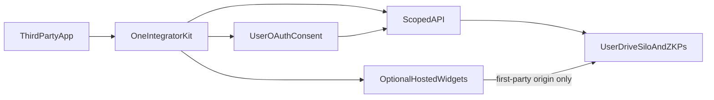

# L5 one-kit review (Ask-mode deep dive)

**Status:** review only — no code changes in this document’s production.  
**Date:** 2026-08-30  
**Purpose:** inventory + gap analysis so a follow-up **upgrade implementation plan** can move developer APIs/SDK to **one kit, many scopes, optional hosted widgets**, deleting parallel paths. No backwards compatibility required (dev / no users).

**Target product shape (agreed):**

| Layer | Rule |
|-------|------|
| One kit | Single integrator façade + shared OAuth UI; no parallel login SDKs |
| Many scopes | Explicit grants for login / silo / ZKPs / public index; never “full Drive” for L5 |
| Hosted widgets | Messaging / social **display** on first-party origin (iframe/embed); third-party JS never holds plaintext DMs or unlock secrets |
| Delete old paths | Upgrade plan removes duplicates; no shims |

---

## 1. Current surface map

### 1.1 API route families

Central registration: [`api/src/server.ts`](../../api/src/server.ts). Hand manifest: [`ROUTE_MANIFEST.md`](./ROUTE_MANIFEST.md).

| Family | Primary files | Auth | Role today |
|--------|---------------|------|------------|
| **`/oauth/*`** | [`pnOAuthRoutes.ts`](../../api/src/server/modules/pnOAuthRoutes.ts), [`pnOAuthService.ts`](../../api/src/server/modules/pnOAuthService.ts) | Unlock proof + consent; token exchange | **Canonical user OAuth** (L4 + L5). SDK defaults here. |
| **`/api/v1/*`** | [`apiRoutes.ts`](../../api/src/server/modules/apiRoutes.ts) | `X-Api-Key` | Public index, standard data points, succession, **parallel** `/api/v1/oauth/*` |
| **`/api/developer/*`** | [`developerSelfServiceRoutes.ts`](../../api/src/server/modules/developerSelfServiceRoutes.ts), [`platformRegistryRoutes.ts`](../../api/src/server/modules/platformRegistryRoutes.ts) | Bearer for `developer-portal` (+ operator allowlist) | Register OAuth clients, API keys, proposals, platform licenses |
| **`/api/integrator/*`** | [`integratorRoutes.ts`](../../api/src/server/modules/integratorRoutes.ts) | Bearer + `cloud:app` | Silo root discovery |
| **`/api/drive/*`** | [`driveRoutes.ts`](../../api/src/server/modules/driveRoutes.ts) + [`integratorDriveContext.ts`](../../api/src/server/modules/integratorDriveContext.ts) | Bearer + Drive context | Shared proxy; **L5 confined** to `integrators/{client_id}/` |
| **`/oauth/zkp-data-points`** | `pnOAuthRoutes.ts` | Bearer + grants sheet | ZKP proofs for consented data points |
| **`/api/widgets/*`**, **`/api/public-index/*`** | [`widgetRoutes.ts`](../../api/src/server/modules/widgetRoutes.ts) | Mixed / public | Legacy script-tag feed embed + non-v1 public index |
| **`/api/admin/*`**, **`POST /oauth/clients`** | admin / break-glass | `ADMIN_API_KEY` | Operator only — keep gated |
| **`/api/auth/google-oauth/*`** | [`googleOAuthRoutes.ts`](../../api/src/server/modules/googleOAuthRoutes.ts) | Google code | Cloud custody — **not** pN identity OAuth |
| **`/api/auth/challenge|verify`** | [`authChallengeRoutes.ts`](../../api/src/server/modules/authChallengeRoutes.ts) | Legacy | 410 / point at `/oauth/token` |
| **First-party product** | `messageRoutes`, `mailboxRoutes`, `connectionRoutes`, `groupRoutes`, `feedRoutes`, `engagementRoutes`, `profileRoutes`, `notificationRoutes`, … | Bearer and/or cloud AT + device caps | L4 browse/messaging — **not** documented as L5 |

### 1.2 SDK / packages

| Package | Path | npm name | Observed publish state |
|---------|------|----------|------------------------|
| Identity SDK | [`sdk/identity-sdk/`](../../sdk/identity-sdk/) | `@identity-protocol/identity-sdk` | Workspace / `file:`; **not on npm** (404). Docs still say `npm install`. |
| OAuth UI | [`packages/oauth-ui/`](../../packages/oauth-ui/) | `@par-noir/oauth-ui` | Same — workspace only |
| Messaging UI | [`packages/messaging-ui/`](../../packages/messaging-ui/) | `@par-noir/messaging-ui` | `"private": true`; **types/contract only** |
| Starter | [`examples/l5-integrator-starter/`](../../examples/l5-integrator-starter/) | private | Dogfood for façade |

**Recommended L5 entry today:** `createPnIntegratorClient` → `auth` + `storage` + `zkp` + `succession` + `publicIndex` ([`PnIntegratorClient.ts`](../../sdk/identity-sdk/src/PnIntegratorClient.ts)).

**Portal today:** [`apps/developer-portal/`](../../apps/developer-portal/) depends on `@par-noir/oauth-ui` only; hand-rolls token exchange in [`PortalContext.tsx`](../../apps/developer-portal/src/context/PortalContext.tsx). Does **not** import the integrator façade.

### 1.3 Docs that define L5

- [`L5_INTEGRATOR_QUICKSTART.md`](./L5_INTEGRATOR_QUICKSTART.md)
- [`third-party-sharing-and-L5.md`](./third-party-sharing-and-L5.md)
- [`PN_OAUTH_INTEGRATION.md`](./PN_OAUTH_INTEGRATION.md)
- [`INTEGRATOR_IDENTITY_SUCCESSION.md`](./INTEGRATOR_IDENTITY_SUCCESSION.md)
- [`PLATFORM_OPERATOR.md`](./PLATFORM_OPERATOR.md)
- [`MESSAGING_UI_SURFACES.md`](../MESSAGING_UI_SURFACES.md) — describes an **L5 embed** contract that is not shipped as React widgets

---

## 2. Parallel / legacy path list (Plan 2 delete or hard-gate)

Recommendation column is for the **upgrade plan** (no users → prefer **delete** over shim).

| Path / export | Observed issue | Plan 2 |
|---------------|----------------|--------|
| **`/api/v1/oauth/authorize` + `/token`** | API-key mint of auth code for `apiKey.pnId` **without interactive unlock proof** (`issueAuthorizationCodeForApiKey`). Parallel to `/oauth/*`. | **Delete** as user-login path, or reframe strictly as “machine credential for the key owner’s own pN” with a different name/route — do not teach as L5 login |
| **`GET /api/public-index/:id`** (`widgetRoutes`) vs **`GET /api/v1/public-index/:id`** | Duplicate public index | Keep **v1 + API key only**; delete or redirect non-v1 |
| **`/api/widgets/feed/*` script embeds** | Old copy-paste JS widget; not first-party hosted iframe model | Replace with hosted widget story or delete |
| **`POST /oauth/clients` (admin)** vs **`/api/developer/oauth-clients`** | Dual registration | Keep developer self-service + admin break-glass; document only one for integrators |
| **`IdentitySDK` / `createIdentitySDK` / `providers.identityProtocol`** | Legacy barrel exports; email-ish scopes in preset | **Remove from public barrel**; kit = `createPnIntegratorClient` only |
| **`providers` dual presets** | `identityProtocol` vs `pnOAuth` | Keep at most `pnOAuth` or delete presets entirely |
| **`CertificatePinning` / `ThreatDetectionEngine` / `DistributedRateLimiter`** | Advanced security exports on same barrel | Drop from L5 kit surface (or internal-only) |
| **`DecentralizedAuthSDK.ts`** | Stub DID auth, not barrel-exported | Delete dead code in upgrade |
| **Empty `sdk/identity-sdk/static/oauth-callback.html`** (0 bytes) vs full [`packages/oauth-ui/static/oauth-callback.html`](../../packages/oauth-ui/static/oauth-callback.html) | Starter/docs point at wrong/empty file | Single canonical callback asset; SDK re-exports or documents oauth-ui path only |
| **Portal hand-rolled OAuth** vs façade | Two ways to finish unlock | Portal **dogfoods** `createPnIntegratorClient` / shared helpers |
| **npm install docs** | Packages not published | Either publish in upgrade or change docs to workspace/git until publish |

---

## 3. Accidental L5 exposure (messaging / social / Drive)

Labeling: **Observed** = read from code. **Inferred** = risk conclusion.

### 3.1 No first-party client gate on product routes

**Observed:** [`gateOwnerRoute`](../../api/src/server/modules/deviceCapabilityService.ts) requires:

1. Valid pN OAuth Bearer whose `pnIdentifier` matches the route target  
2. Device capability (`messages.read` / `messages.send` / etc.)

It does **not** call `isFirstPartyClient(tokenPayload.clientId)`.

**Observed:** First-party client IDs are defined in [`integratorStoragePaths.ts`](../../api/src/server/modules/integratorStoragePaths.ts) (`browser-app`, `messaging-app`, `prism-app`, `developer-portal`) and used for **Drive silo** paths — not for message/connection/group route entry.

**Observed:** [`messageRoutes.ts`](../../api/src/server/modules/messageRoutes.ts) uses `gateOwnerRoute` + `resolveOwnerDriveToken` (under custody: `X-PN-Cloud-Access-Token`).

**Observed:** [`connectionRoutes.ts`](../../api/src/server/modules/connectionRoutes.ts) `GET /api/connections` uses `requireOwnerDriveContextFromReq` (cloud AT) and query `userPnIdentifier` — **no Bearer check in that handler**.

**Inferred:** With **device cloud custody on**, a normal L5 OAuth Bearer **alone** should not complete Drive-backed messaging/social calls (409 `cloud_token_required`) unless the integrator also obtains the user’s Google access token. L5 interactive consent is not supposed to hand them that token.

**Inferred:** Residual compromise paths:

1. L5 app also obtains `X-PN-Cloud-Access-Token` (phishing vault, malicious unlock page, user paste, or abuse of [`POST /oauth/authorize/drive-token`](../../api/src/server/modules/pnOAuthRoutes.ts) which accepts auth `code` + Google `refresh_token` without first-party client check).  
2. **`DEVICE_CLOUD_CUSTODY=0`** — stored Drive secrets may satisfy `resolveOwnerDriveToken`, so Bearer + device caps may be enough for messages.  
3. Connections path that only needs cloud AT + `userPnIdentifier` is weaker than gated message routes.

**Plan 2 must falsify with a gate test:** third-party `client_id` Bearer → `/api/messages/*`, `/api/mailbox/*`, `/api/connections/*`, `/api/groups/*` → **403** regardless of cloud header. First-party allowlist only (or dedicated scopes that are never issued to L5 clients).

### 3.2 Intended L5 surfaces (keep)

| Surface | Gate today |
|---------|------------|
| `/oauth/*` interactive consent + token | Unlock proof |
| `/api/integrator/storage-root` | Bearer + `cloud:app` + not first-party silo semantics |
| `/api/drive/*` for L5 | `integratorDriveContext` + silo confinement |
| `/oauth/zkp-data-points` | Bearer + permissions sheet |
| `/api/v1/public-index`, `/api/v1/standard-data-points`, succession | API key scopes |
| `/api/developer/*` | Portal client |

---

## 4. Scope and consent model

### 4.1 OAuth scopes (user Bearer)

| Scope | Meaning | Enforcement (observed) |
|-------|---------|------------------------|
| `openid`, `profile` | Session / identity | Consent + `validateScopes` |
| `cloud:app` | R/W under `integrators/{client_id}/` | `scopesIncludeCloudApp`; silo provision in `integratorOAuthGrants`; Drive confinement |
| `cloud:read` | Broad Drive read | Documented **first-party**; contracts in [`clientContracts.ts`](../../packages/standard-data-points/src/clientContracts.ts) for `browser-app` / `messaging-app` |
| `zkp:*` / `data_point:*` | Request ZKP rows | `dataPointIdsFromScopes`; grants sheet; `/oauth/zkp-data-points` |

SDK default L5 set: `PN_INTEGRATOR_SCOPES` = `openid`, `profile`, `cloud:app` ([`pnApiClient.ts`](../../sdk/identity-sdk/src/integrator/pnApiClient.ts)).

`ClientRegistrationService.validateScopes`: if client has empty scopes list, **all requested scopes pass** (`return true`). Plan 2 should fail closed (empty registered scopes → deny elevate).

### 4.2 API key scopes (server)

Default on create: `oauth`, `data_points`, `content` ([`apiKeyService.ts`](../../api/src/server/modules/apiKeyService.ts)).

| Key scope | Routes |
|-----------|--------|
| `content` | `/api/v1/public-index/:id` |
| `data_points` | `/api/v1/data-points/*` style |
| `oauth` | Default; used with `/api/v1/oauth/*` |

**Gap:** two vocabularies (OAuth vs API key) with overlapping English names. Upgrade should document a single integrator mental model: **user scopes** vs **server key scopes**, and not use `/api/v1/oauth` as “login.”

### 4.3 Consent UX

- First-party browse/messaging: same-origin authorize HTML + messaging ML-KEM handoff ([`MESSAGING_UI_SURFACES.md`](../MESSAGING_UI_SURFACES.md)).  
- L5 / portal / Prism: API-hosted consent (`/oauth/consent`) — **no** messaging handoff required.  
- Consent Step 2 for `cloud:app` silo is part of the intended L5 story.

---

## 5. Gap vs one kit / many scopes / hosted widgets

| Ideal | Observed gap |
|-------|----------------|
| One kit | Two packages + legacy `IdentitySDK` still exported; portal does not dogfood façade |
| Many scopes | Scopes exist for login/silo/ZKP; **no** hard deny of product routes by `client_id`; empty client scope list is permissive |
| Optional hosted widgets | `UnlockButton` is in-app React, not hosted iframe; `@par-noir/messaging-ui` types-only; docs describe L5 embed that isn’t shipped; `widgetRoutes` are old script embeds for feeds |
| Secure by default | Product routes lack `isFirstPartyClient`; `/api/v1/oauth/authorize` mints codes without unlock proof for key owner pN; `drive-token` not first-party-gated |
| Packaging | Empty SDK static callback; npm install instructions ahead of registry |

### What “hosted widgets” should mean here (recommendation)

**MVP widget set for Plan 2:**

1. **Unlock / consent** — already first-party hosted (`/oauth/consent` or browse authorize). Kit only launches it; never collects pn name/passcode in integrator UI.  
2. **Optional messaging shell** — iframe from `messaging.parnoir.com` (or dedicated embed origin) that completes its **own** first-party unlock/handoff; postMessage limited to opaque session signals already sketched in `@par-noir/messaging-ui` types — **no** L5 Bearer access to `/api/messages`.  
3. **Optional public feed embed** — first-party hosted page reading public index; replace script-tag `widgetRoutes` or gate them behind the same host.

**Non-goals:** third-party plaintext DM API; L5 `cloud:read`; social graph harvest API for arbitrary clients.

---

## 6. Recommended target architecture (after upgrade)

### 6.1 Packages

- **`@identity-protocol/identity-sdk`** (or rename to `@par-noir/integrator-sdk` if desired): **only** `createPnIntegratorClient`, storage/ZKP/succession/publicIndex, scope constants, types.  
- **`@par-noir/oauth-ui`**: Unlock/Lock + popup helpers + **single** `oauth-callback.html`.  
- **`@par-noir/messaging-ui`**: either stay private until real embed components ship, or become the iframe contract + thin host helpers — not a ciphertext mailbox client for L5.

### 6.2 API

| Keep | Delete / deny |
|------|----------------|
| `/oauth/*` interactive user OAuth | `/api/v1/oauth/*` as login (or rename to non-OAuth machine mint) |
| `/api/v1/*` for key-scoped public/catalog/succession | Duplicate `/api/public-index` |
| `/api/integrator/*` + siloed `/api/drive/*` | L5 access to `/api/messages`, `/api/mailbox`, `/api/connections`, `/api/groups`, `/api/feeds` mutate, etc. |
| `/api/developer/*` | — |
| Hosted embed routes under first-party origins | Ungated script widgets that imply full product access |

**New ratchet (Plan 2):** `scripts/check-l5-product-route-boundary.sh` (or Jest gate): any route under messaging/social/mailbox requires `isFirstPartyClient` (or equivalent allowlist). Prove fails on synthetic third-party client.

### 6.3 Developer portal

- Credentials + data points + OpenAPI + guides remain.  
- Guides teach **one** install path and **one** client.  
- Portal unlock uses the same kit as integrators.

---

## 7. Draft outline for Plan 2 (upgrade implementation)

Ordered for delete-first / fail-closed. No backwards-compat shims.

1. **Security gates first**  
   - Add first-party (or deny-L5) checks on message, mailbox, connection, group, and other owner product routes.  
   - Gate or remove `POST /oauth/authorize/drive-token` for non-first-party clients.  
   - Fail closed: `validateScopes` when registered scopes empty.  
   - Add falsifying gate tests + wire pre-commit/CI.

2. **Collapse OAuth stories**  
   - Remove or quarantine `/api/v1/oauth/*` from integrator docs and SDK.  
   - Single interactive authorize/token path: `/oauth/*`.

3. **Collapse public index / widgets**  
   - One public-index route (`/api/v1/...` + `content` key).  
   - Replace or delete script-tag feed widgets; design hosted feed iframe if needed.

4. **SDK barrel cleanup**  
   - Public exports = integrator façade + types + scope constants.  
   - Delete or un-export `IdentitySDK` / dual providers / advancedSecurity from L5 surface.  
   - Fix callback HTML to one canonical file; update starter + quickstart.

5. **Portal dogfood**  
   - Use shared token helpers / façade; remove duplicate exchange logic where safe.

6. **Hosted messaging widget (optional MVP slice)**  
   - Embeddable first-party messaging origin + postMessage contract from `messaging-ui` types.  
   - Explicitly **no** new L5 message REST access.

7. **Docs + packaging**  
   - Rewrite L5 quickstart / Integrate / Docs pages to one-kit narrative.  
   - Align npm publish script with reality (publish or stop claiming `npm install` from registry).

8. **Acceptance (behavioral)**  
   - Starter: unlock → silo upload → ZKP fetch works.  
   - Synthetic L5 client: product routes 403.  
   - First-party browse/messaging: unchanged unlock + DM.  
   - Portal: register client + create API key after unlock.

---

## 8. How to use this doc

Reference this file from the upgrade plan:

`docs/developer/L5_ONE_KIT_REVIEW.md`

Treat §2 (delete list), §3 (exposure), and §7 (ordered work) as the backlog spine. Re-verify any “Inferred” item with a failing gate test before declaring the upgrade done.

---

## Appendix A — Key file index

| Concern | Path |
|---------|------|
| OAuth routes | `api/src/server/modules/pnOAuthRoutes.ts` |
| v1 + API-key OAuth | `api/src/server/modules/apiRoutes.ts` |
| Developer self-service | `api/src/server/modules/developerSelfServiceRoutes.ts` |
| Silo paths / first-party IDs | `api/src/server/modules/integratorStoragePaths.ts` |
| Drive L5 context | `api/src/server/modules/integratorDriveContext.ts` |
| Owner Drive token | `api/src/server/modules/ownerDriveToken.ts` |
| Device gate | `api/src/server/modules/deviceCapabilityService.ts` |
| First-party contracts | `packages/standard-data-points/src/clientContracts.ts` |
| Integrator façade | `sdk/identity-sdk/src/PnIntegratorClient.ts` |
| SDK barrel | `sdk/identity-sdk/src/index.ts` |
| OAuth UI | `packages/oauth-ui/` |
| Messaging embed types | `packages/messaging-ui/src/index.ts` |
| Starter | `examples/l5-integrator-starter/` |
| Portal | `apps/developer-portal/` |

## Appendix B — Review method notes

- Conducted as read-only code/docs inventory (Ask deep-dive).  
- Did **not** run live exploit against production.  
- Messaging empty-doc stubs (`MESSAGING_COORDINATOR_POLICY.md` / ADR files may be empty in tree) — relied on `MESSAGING_UI_SURFACES.md` + route code.  
- Custody default assumed on for production posture per ops checklist; opt-out changes exposure conclusions in §3.

---

## Plan 2 upgrade status (implementation)

| §7 item | Status |
|---------|--------|
| 1 Security gates (first-party product routes, drive-token, validateScopes fail-closed) | Done |
| 2 Collapse `/api/v1/oauth/*` | Done (deleted) |
| 3 One public index (`/api/v1/...` only); feed widgets kept for dashboard | Done |
| 4 SDK barrel = integrator façade; callback via oauth-ui | Done |
| 5 Portal dogfoods `createPNOAuthClient` | Done |
| 6 Hosted messaging widget | **Deferred** |
| 7 Docs + workspace install narrative | Done |
| 8 Acceptance / gate tests + CI ratchet | Done (`l5ProductRouteBoundary.gate.test.ts`, `scripts/check-l5-product-route-boundary.sh`) |
