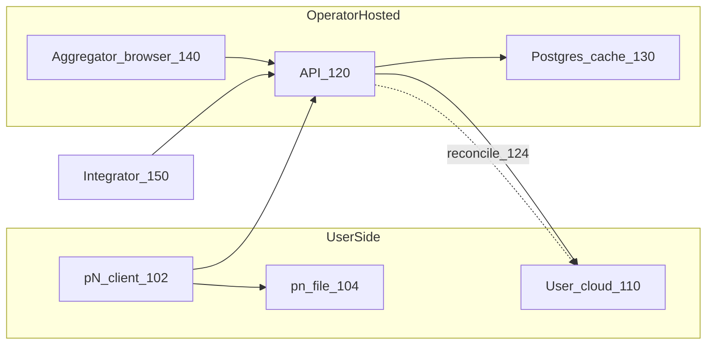
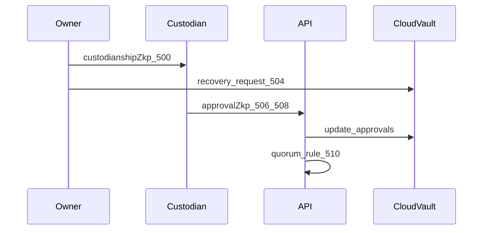
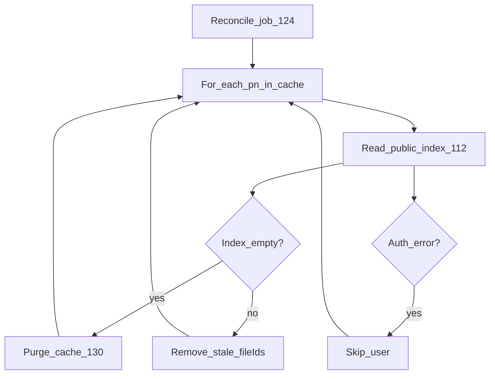
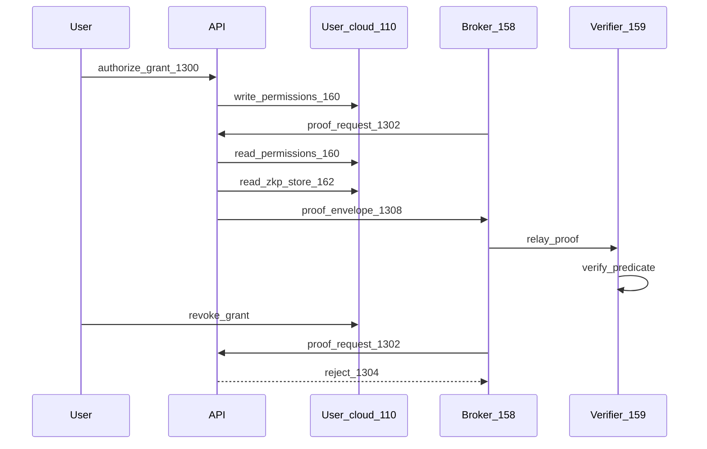

# Patent figures specification

**Purpose:** Descriptions for USPTO drawing sheets. Counsel or a drawings vendor converts these to black-and-white figures with reference numerals. Mermaid diagrams below are layout guides only—not filing drawings.

---

## FIG. 1 — System architecture

**Type:** Block diagram

**Description:** Overall par Noir system comprising: user device 100 running pN client 102; user-controlled cloud storage 110 (e.g. cloud drive); coordinating API server 120; aggregator cache database 130; aggregator browser client 140; third-party integrator 150.

**Connections:**

- pN client 102 reads/writes identity file 104 locally and syncs metadata to cloud 110 via API 120.
- API 120 mediates storage OAuth for cloud 110; holds OAuth client registry 122, not user unlock secrets.
- API 120 writes aggregator cache 130 and runs reconcile module 124 against public index 112 on cloud 110.
- Browser 140 fetches feeds from API 120 only (no direct cloud provider API).
- Integrator 150 accesses user cloud 110 only via API 120 scoped paths.



---

## FIG. 2 — Identity creation

**Type:** Flowchart

**Description:** Method of creating a pN identity:

1. User supplies pn name and passcode at step 200.
2. System generates ML-DSA-65 and ML-KEM-768 key pairs at step 202.
3. System encrypts identity payload with key derived from pn name and passcode at step 204.
4. System generates recovery master and splits via Shamir (threshold T, total N) at step 206.
5. System encrypts recovery payload into recovery envelope at step 208.
6. System seals Shamir shares with pn name and passcode into sealed shares block at step 210.
7. System writes portable identity file 104 comprising public keys, ciphertext, recovery envelope, sealed shares at step 212.
8. System distributes unassigned shares to custodian entities at step 214.

---

## FIG. 3 — Three-factor unlock

**Type:** Flowchart

**Description:**

1. User provides identity file 104, pn name, and passcode at step 300.
2. System derives decryption key from pn name and passcode at step 302.
3. System decrypts identity payload at step 304; on failure, abort at step 306.
4. System optionally unseals recovery shares using same factors at step 308.
5. System exposes ML-DSA signing and ML-KEM encapsulation capabilities at step 310.

**Note:** All three factors required; missing any factor prevents decryption.

---

## FIG. 4 — Recovery vault state machine

**Type:** State diagram + data structure

**Description:** Recovery vault spreadsheet 400 on user cloud 110 includes:

- **PendingShares sheet 402** — share indices with owner-public-key-encrypted share blobs awaiting custodian assignment.
- **Custodians sheet 404** — rows with fields: custodianId, shareIndex, status (invited / accepted / revoked), unrevokable flag 406.

**State transitions:**

- invited → accepted (custodian accepts invitation)
- invited or accepted → revoked (owner revokes revokable custodian only)
- unrevokable custodian 406: revoke blocked

**Recovery Ready condition 408:** count(accepted) ≥ threshold AND count(accepted where unrevokable) ≥ 1.

---

## FIG. 5 — Custodian ZK approval sequence

**Type:** Sequence diagram

**Description:**

1. Owner issues custodianship ZK envelope 500 binding identity public key, custodian id, share index, invitation id, optional unrevokable flag.
2. Custodian stores custodianship credential 502.
3. On recovery request 504, custodian generates approval ZK envelope 506 binding request id, custodian id, share index.
4. Custodian submits approval payload 508 (custodianshipZkp + approvalZkp) to API 120.
5. API 120 verifies ZK envelopes and updates recovery request row on cloud 110.
6. API 120 evaluates quorum rule 510 (threshold + unrevokable approval).



---

## FIG. 6 — Shamir recovery completion (same public key)

**Type:** Flowchart

**Description:**

1. Quorum rule satisfied at step 600.
2. System collects Shamir shares from custodian vault and/or sealed shares at step 602.
3. System combines shares to recovery master at step 604.
4. System decrypts recovery envelope to recovery payload at step 606.
5. System verifies recovery payload public key matches existing identity public key at step 608.
6. User supplies new passcode at step 610.
7. System re-encrypts identity payload with new passcode; **public key unchanged** at step 612.

---

## FIG. 7 — Re-key migration pipeline

**Type:** Flowchart

**Description:** User-initiated cryptographic rotation:

1. User unlocks predecessor identity at step 700.
2. System generates new ML-DSA/ML-KEM key pairs at step 702.
3. System pins cloud folder id 704 in storage credentials.
4. Migration steps execute: zkp_reissue 706, drive_files re-wrap 708, recovery_vault rebuild 710, dm_rekey 712, lineage_zkp 714.
5. System renames cloud folder to successor pn identifier at step 716.
6. System registers network succession at step 718 (predecessor revoked online).

---

## FIG. 8 — Network succession effects

**Type:** Diagram

**Description:**

- Predecessor pn identifier 800: OAuth codes, token refresh, storage binding, feed creation **rejected** online.
- Successor pn identifier 802: assumes network-backed features.
- Offline: predecessor identity file 104 may still decrypt locally ("picture on the wall") 804.
- Integrators poll succession endpoint 806 to stop trusting predecessor.

---

## FIG. 9 — User cloud folder layout

**Type:** Tree diagram

**Description:**

```
par Noir - {pnIdentifier}/
  _metadata/
    profile.json
    public-file-index.xlsx      (112)
    owner-file-index.xlsx
    recovery.xlsx               (400)
    zkp-data-points.xlsx
    third-party-permissions.xlsx
    integrators/
      {oauth_client_id}/       (integrator silo)
    media/ thoughts/ collections/
      *-public-index.xlsx
  par-noir-messages/           (on demand)
```

---

## FIG. 10 — Public index reconcile loop

**Type:** Flowchart

**Description:**

1. Reconcile job 124 wakes on interval (e.g. 5 min) at step 1000.
2. For each pn identifier with cache rows in database 130 at step 1002.
3. Load authorized public file ids from owner's public index 112 on cloud 110 at step 1004.
4. If index missing or empty public set → purge all cache rows for user at step 1006.
5. Else remove cache rows whose fileId ∉ authorized set at step 1008.
6. On cloud auth error → skip user (do not purge) at step 1010.
7. Aggregator browser 140 reads cache 130 via API 120 at step 1012.



---

## FIG. 11 — Integrator silo and API confinement

**Type:** Block diagram

**Description:**

1. Integrator 150 registers OAuth client id 152 with API 120.
2. On first `cloud:app` grant, API provisions folder `integrators/{client_id}/` on cloud 110.
3. Drive proxy 154 confines read/write/delete to that subtree only.
4. Standard ZKP data points remain in `zkp-data-points.xlsx`; accessed via ZKP API 156, not integrator folder.

---

## FIG. 12 — ZK proof envelope v2 structure

**Type:** Structural diagram

**Description:** ZK envelope 1200 fields:

- `format_version` 2, `zk_proof_version` 2
- `zk_proof_type`: `stark_genstark_sha256_ml_dsa_binding_v2`
- `hash_policy`: SHA3-384
- `public_inputs`, `context`, `nonce`, `expires_at_ms`
- `stark_binding_sha3_384_b64`, `stark_proof_b64`, `stark_final_r0_decimal`
- `ml_dsa_public_key_b64`, `ml_dsa_signature_b64` (outer binding)

Verification order: expiry → binding digest → ML-DSA signature → STARK verify.

---

## FIG. 13 — User-sovereign selective disclosure via broker entity

**Type:** Sequence diagram

**Description:** Flow in which the user—not the platform—is the authoritative store for consent and attestations; a broker entity may relay proofs without holding the identity vault.

**Participants:**

- User device 100 / pN client 102
- User cloud 110
- Permissions sheet 160 (`third-party-permissions.xlsx`)
- Data-points store 162 (`zkp-data-points.xlsx`)
- Coordinating API 120 / proof API 156
- Broker entity 158 (integrator, data union, or data exchange)
- Verifier / buyer 159

**Sequence:**

1. User authorizes grant 1300; API writes permission row to sheet 160 on cloud 110.
2. Broker 158 submits proof request 1302 to API 156 with scoped bearer token.
3. API reads sheet 160; if grant missing or expired → reject 1304.
4. API retrieves ZK envelope from store 162; verifies binding and expiry 1306.
5. API returns proof envelope 1308 to broker 158; no plaintext sensitive attributes transmitted.
6. Verifier 159 evaluates predicate from envelope public inputs.
7. User revokes grant in sheet 160 → subsequent requests fail at 1304.

**Key property:** Broker 158 and API 120 do not store pn name, passcode, private keys, or cleartext PII. Economic settlement (paid access) is optional L5 embodiment outside core protocol.



---

## Reference numeral master list (for drawings vendor)

| Numeral | Element |
|---------|---------|
| 100 | User device |
| 102 | pN client |
| 104 | Portable identity file (.pn) |
| 110 | User-controlled cloud storage |
| 112 | Public file index |
| 120 | Coordinating API server |
| 122 | OAuth client registry |
| 124 | Reconcile module |
| 130 | Aggregator cache database |
| 140 | Aggregator browser |
| 150 | Third-party integrator |
| 400 | Recovery vault spreadsheet |
| 402 | PendingShares |
| 404 | Custodians sheet |
| 406 | Unrevokable flag |
| 500–510 | ZK approval sequence |
| 600–612 | Shamir recovery steps |
| 700–718 | Re-key migration steps |
| 800–806 | Succession |
| 1000–1012 | Reconcile steps |
| 1200 | ZK v2 envelope |
| 158 | Broker entity (union, exchange, integrator) |
| 159 | Verifier / buyer |
| 160 | Third-party permissions sheet |
| 162 | ZKP data-points store |
| 1300–1308 | Selective disclosure sequence steps |

---

## Aug 2025 provisional figures — disposition

| Old figure | Replacement |
|------------|-------------|
| FIG. 1 (generic 8-module system) | FIG. 1 (architecture with cloud + reconcile) |
| FIG. 2 (social recovery) | FIG. 4, 5, 6 (vault + ZK + completion) |
| FIG. 3 (decentralized auth without OAuth) | FIG. 3 (three-factor unlock); OAuth in FIG. 1 only |
| FIG. 4 (ML commercial detection) | **Omitted** |
| FIG. 5 (license transfer) | Optional dependent; not standalone figure |
| FIG. 6 (hybrid PQC + ECDSA) | FIG. 12 (ZK v2); PQC in FIG. 2 |
