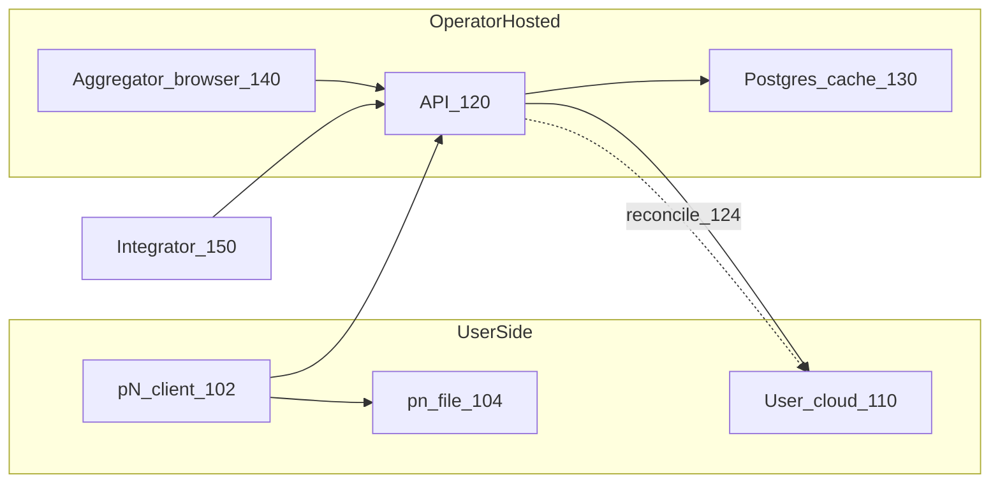
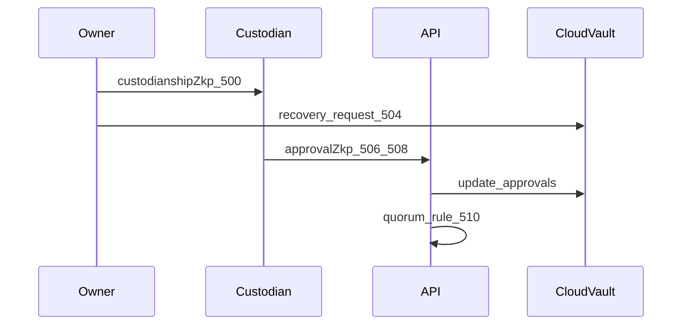
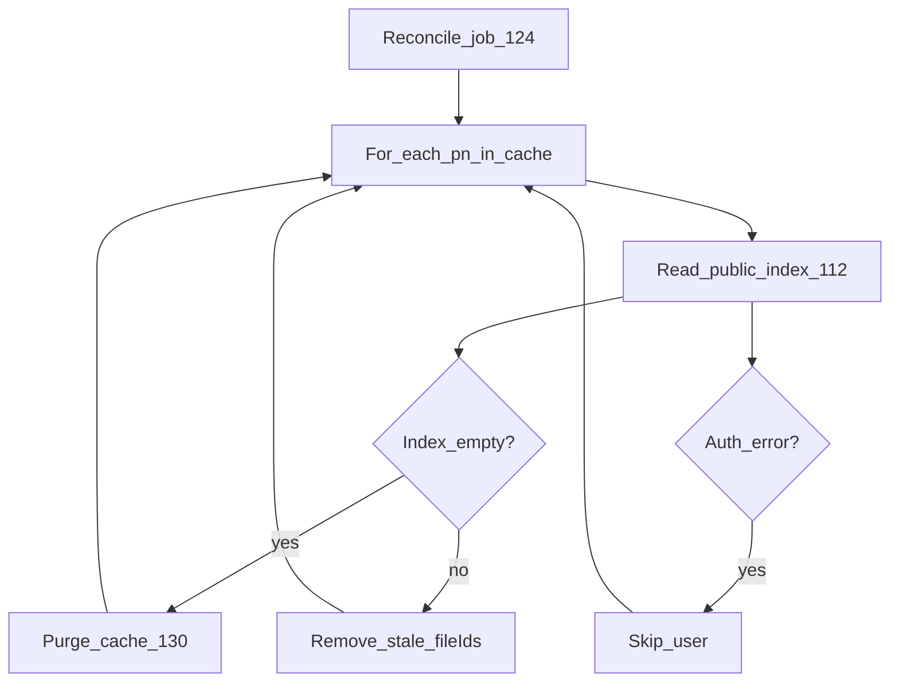
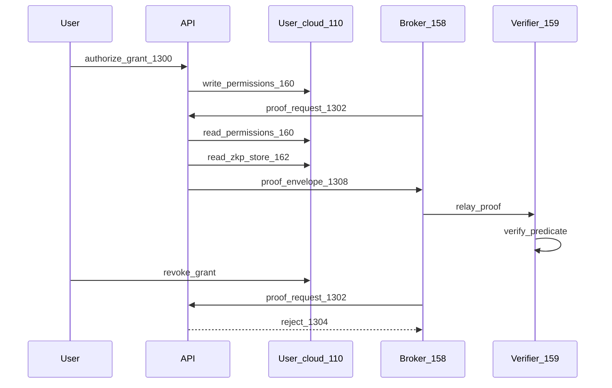

# PATENT APPLICATION — MERGED DRAFT

**ATTORNEY REVIEW REQUIRED — NOT FOR FILING AS-IS**

| Field | Value |
|-------|-------|
| Inventor | Mark Jonathan Mazzei |
| Provisional filed | August 26, 2025 |
| Provisional no. | **[TO BE SUPPLIED]** |
| Recommended filing | Continuation-in-part (CIP) or nonprovisional |
| Hard deadline | **August 26, 2026** |
| Status | Merged technical draft — specification + claims + figure specs |
| Source parts | [NONPROVISIONAL_DRAFT.md](./NONPROVISIONAL_DRAFT.md), [CLAIMS_DRAFT.md](./CLAIMS_DRAFT.md), [FIGURES.md](./FIGURES.md) |

This document merges the specification, example claims, and detailed figure specifications into one counsel-review package. **USPTO filing still requires:** formal claim refinement, black-and-white drawing PDFs, Application Data Sheet, fees, inventor declaration, and power of attorney.

## Table of contents

1. [Specification](#part-i--specification)
2. [Claims](#part-ii--claims)
3. [Abstract](#part-iii--abstract)
4. [Appendix A — Figure specifications (drawings vendor)](#appendix-a--figure-specifications-for-drawings-vendor)
5. [Appendix B — Counsel notes and omitted subject matter](#appendix-b--counsel-notes-and-omitted-subject-matter)

---

# PART I — SPECIFICATION


## CROSS-REFERENCE TO RELATED APPLICATIONS

This application claims the benefit of priority under 35 U.S.C. § 119(e) to U.S. Provisional Application No. **[TO BE SUPPLIED]**, filed August 26, 2025, entitled *Distributed Identity Management System with Social Recovery and Unified License Framework*, the entire contents of which are incorporated herein by reference.

Counsel to confirm whether to file as **nonprovisional** or **continuation-in-part (CIP)** and to map priority for new matter described herein.

---

## TITLE OF THE INVENTION

**Computer-Implemented Protocol for User-Held Post-Quantum Identity, User-Owned Cloud Recovery Vault, and Reconciled Public Content Indexing**

---

## FIELD OF THE INVENTION

The present invention relates to computer-implemented identity management, cryptographic recovery, user-controlled cloud storage, and content aggregation. More particularly, embodiments relate to a portable post-quantum identity artifact, a recovery vault on user-owned cloud storage with threshold custodian policy including protected custodians, dual-path identity continuity (same-key recovery and re-key succession), and a public content aggregator whose membership truth is a user-authored index reconciled against a performance cache.

---

## BACKGROUND

### Problems in conventional identity and content systems

Traditional identity systems rely on centralized issuers. Users cannot self-issue cryptographic identity without a registration authority. Recovery typically depends on email reset, help desks, or seed phrases held by a single person. Loss of the seed or device often implies permanent loss of identity-bound resources.

Social and wallet systems have introduced guardian-based recovery and Shamir secret sharing for cryptocurrency keys. Such systems generally target wallet seeds, on-chain smart contract guardians, or hardware security module custodians—not a portable identity file integrated with a structured user-owned cloud layout spanning identity metadata, recovery state, permissions, and public indexes.

Self-sovereign identity (SSI) frameworks promote decentralized identifiers (DIDs) and verifiable credentials. Many implementations anchor DIDs on distributed ledgers and treat wallet backup as a separate concern. Few specify a three-factor portable file, a cloud-resident recovery vault with explicit custodian lifecycle and protected custodian rules, and a dual-path model distinguishing same-key recovery from full cryptographic re-key with network succession.

Content aggregation platforms typically store public content membership in operator-controlled databases. When a user deletes content or revokes public visibility in their own storage, operator caches may remain stale. Personal-data vault patents describe aggregating private user data to user-controlled storage but do not treat a user-authored **public index** as authoritative membership truth for a reconciled public feed.

Under surveillance-capitalism models, platforms also become the system of record for user profiles, behavioral data, and third-party sharing consent. Users cannot revoke access at the authoritative store; operators monetize harvested data. Selective disclosure via cryptographic proofs, with grants recorded on user-controlled storage and revocable by the user, is not widely specified as a unified protocol alongside portable identity and user-owned cloud layout.

Third-party applications traditionally store user data in application-specific databases. A model in which each integrator receives a confined folder on the user's own cloud, with standard identity data points accessed only through proof APIs, is not widely specified. A further embodiment in which broker entities (e.g. data unions or exchanges) obtain user consent and relay zero-knowledge proofs or aggregated attestations to verifiers—without storing the underlying identity vault—is not specified in prior personal-cloud or SSI systems.

### Need for the invention

There is a need for a unified protocol in which:

1. A user holds a self-issued post-quantum identity artifact unlocked only by three factors.
2. Recovery state and public visibility state live on user-controlled cloud storage under a defined layout.
3. Social recovery requires both threshold custodian approval and approval from a protected custodian, with cryptographic proof of authorization.
4. Identity continuity supports both same-key recovery and full re-key with pinned cloud folder migration and network succession.
5. Public feeds are served from a cache reconciled against the user's public index, without the operator owning membership truth.
6. Third-party access to sensitive attributes is mediated through user-held permission records and zero-knowledge proofs, enabling users—or broker entities acting with user consent—to grant and revoke selective disclosure without surrendering raw data to a platform database.

---

## SUMMARY OF THE INVENTION

In one aspect, a computer-implemented method comprises: receiving, at a client device, a portable identity file, a pn name, and a passcode; deriving a decryption key from the pn name and passcode; decrypting a post-quantum identity payload bound to ML-DSA and ML-KEM key material; and accessing a recovery vault on user-controlled cloud storage that tracks custodian entities, share indices, and approval records.

In another aspect, a recovery method comprises: receiving a threshold number of custodian approvals each accompanied by a custodianship zero-knowledge proof and an approval zero-knowledge proof; verifying that at least one approval corresponds to a protected custodian in accepted status; combining Shamir shares to obtain a recovery master; decrypting a recovery envelope; and re-encrypting the identity payload with a new passcode while preserving an identity public key.

In another aspect, a re-key migration method comprises: generating new post-quantum keys; pinning a user cloud folder identifier; migrating encrypted objects and index sheets within the pinned folder; generating a lineage proof binding predecessor and successor identifiers; and registering network succession such that a predecessor identifier is rejected for online network-backed operations while offline decryption of a predecessor file remains possible.

In another aspect, an aggregation method comprises: maintaining a server-side cache of public content metadata; periodically reading a user-authored public file index from user-controlled cloud storage; removing cache entries not listed in the index; and serving feed queries from the cache.

In another aspect, a selective disclosure method comprises: storing, on user-controlled cloud storage, a permissions record listing integrator grants and a data-points store of zero-knowledge proof envelopes; receiving a proof request from an integrator or broker entity; verifying that the permissions record authorizes the request; and returning a proof envelope satisfying a predicate without transmitting underlying plaintext sensitive attributes.

Representative embodiments are illustrated in FIG. 1 through FIG. 13.

---

## BRIEF DESCRIPTION OF THE DRAWINGS

**FIG. 1** is a block diagram of a par Noir system architecture including a pN client, user cloud, coordinating API, aggregator cache, aggregator browser, and integrator.

**FIG. 2** is a flowchart of identity creation including post-quantum key generation, Shamir splitting, and sealed shares.

**FIG. 3** is a flowchart of three-factor unlock of the portable identity file.

**FIG. 4** is a state diagram of a recovery vault spreadsheet including pending shares, custodian rows, and an unrevokable flag.

**FIG. 5** is a sequence diagram of custodian zero-knowledge approval submission and quorum evaluation.

**FIG. 6** is a flowchart of Shamir recovery completion preserving the identity public key.

**FIG. 7** is a flowchart of a re-key migration pipeline with pinned folder continuity.

**FIG. 8** is a diagram of network succession effects on predecessor and successor identifiers.

**FIG. 9** is a tree diagram of a user cloud folder layout.

**FIG. 10** is a flowchart of a public index reconcile loop.

**FIG. 11** is a block diagram of an integrator silo with API path confinement.

**FIG. 12** is a structural diagram of a zero-knowledge proof envelope version 2.

**FIG. 13** is a sequence diagram of user-sovereign selective disclosure via a broker entity (integrator, data union, or exchange).

---

## DETAILED DESCRIPTION

### Definitions

As used herein:

- **Portable identity file (pN file)** — A user-held digital artifact containing at least an encrypted identity payload, optional recovery envelope, and optional passcode-sealed Shamir shares.
- **pn name** — A user-chosen identifier participating in key derivation with the passcode.
- **Passcode** — A user-chosen secret participating in key derivation with the pn name.
- **Three-factor unlock** — Decryption requiring the portable identity file, pn name, and passcode together.
- **Recovery master** — A random secret from which Shamir shares are derived and which keys the recovery envelope.
- **Custodian entity** — A trusted party (person, service, self, or device) designated to hold a Shamir share and approve recovery.
- **Protected custodian (unrevokable)** — A custodian assigned with a flag preventing owner revocation; required for recovery completion in representative embodiments.
- **Recovery vault** — User-cloud state, e.g. a spreadsheet, tracking pending shares, custodian assignments, and recovery requests.
- **Public index** — A user-authored list of publicly visible file identifiers on user-controlled cloud storage.
- **Reconcile** — A background process aligning a server cache with the public index.
- **Predecessor / successor** — Network identifiers before and after a re-key migration; predecessor retired online after succession registration.
- **Broker entity** — A third party (integrator, data union, data exchange, or verifier-facing intermediary) that obtains user consent and relays zero-knowledge proofs or aggregated attestations without holding pn name, passcode, or private keys.
- **Selective disclosure** — Releasing a cryptographic proof that a predicate holds (e.g. age threshold) without releasing underlying plaintext sensitive attributes.

### System overview (FIG. 1)

System 10 includes user device 100 executing pN client 102. User device 100 stores portable identity file 104 locally. User-controlled cloud storage 110 (e.g. Google Drive or another provider) holds folder tree 111 under a pn-specific root. Coordinating API server 120 mediates storage access using stored OAuth credentials; API 120 maintains OAuth client registry 122 for third-party applications but does not store pn name, passcode, or private keys. Reconcile module 124 periodically aligns aggregator cache database 130 with public index 112 on cloud 110. Aggregator browser 140 requests feeds only from API 120. Integrator 150 accesses user cloud 110 only through scoped API drive proxy paths.

This architecture inverts surveillance-capitalism data ownership: **the user is the source of truth** for identity metadata, recovery state, public membership, third-party permissions, and stored attestations on cloud 110. The operator cache 130 and API 120 are coordinators and performance derivatives—not authoritative stores for membership, consent, or sensitive attributes. Users may grant integrators or broker entities selective access via proofs; revocation updates user-held permission records without requiring operator cooperation.

### Identity creation (FIG. 2)

Upon user request to create an identity, client 102 receives pn name and passcode at step 200. At step 202, client 102 invokes post-quantum key generation producing ML-DSA-65 signing keys and ML-KEM-768 encapsulation keys. Identity wire format version 1 records `sigAlgId=ML-DSA-65`, `kemAlgId=ML-KEM-768`, `hashPolicyId=SHA3-384`.

At step 204, client 102 encrypts a JSON identity payload containing private keys and metadata using AES-GCM with a key derived from pn name and passcode (e.g. PBKDF2 with SHA-512, one million iterations, per-shard salt). Public keys remain available in cleartext in file 104 for binding and verification.

At step 206, client 102 generates recovery master R (e.g. 32 random bytes) and applies Shamir secret sharing with threshold T and total shares N, where in representative embodiments 2 ≤ T ≤ 5 and T ≤ N ≤ 5.

At step 208, client 102 builds recovery payload including identity id, pn name, public key, recovery configuration, and sealed PQC secret references; encrypts payload with AES-GCM keyed by R to form recovery envelope 209.

At step 210, client 102 seals the list of Shamir shares into sealed shares block 211 using AES-GCM with key derived solely from pn name and passcode, distinct from identity payload encryption salt.

At step 212, client 102 assembles file 104. At step 214, owner distributes individual shares to custodian entities; unassigned shares may be stored encrypted in recovery vault pending shares sheet 402 on cloud 110.

### Three-factor unlock (FIG. 3)

Unlock at step 300 requires file 104, pn name, and passcode. Step 302 derives key material. Step 304 decrypts identity payload; failure at step 306 indicates wrong factors or corrupted file. Step 308 optionally unseals shares from block 211. Step 310 exposes signing and encapsulation to client modules. Session objects stored on device 100 exclude pn name and passcode.

### User cloud layout (FIG. 9)

Under root `par Noir - {pnIdentifier}/`, metadata folder `_metadata/` contains:

- `profile.json` — non-secret profile fields
- `public-file-index.xlsx` (112) — authoritative public membership list
- `owner-file-index.xlsx` — private file index
- `recovery.xlsx` (400) — recovery vault
- `zkp-data-points.xlsx` — stored ZK proof envelopes for standard data points
- `third-party-permissions.xlsx` — integrator grants
- `integrators/` root with per-`{oauth_client_id}` silos (FIG. 11)
- Content-class subfolders (`media/`, `thoughts/`, `collections/`) each with public and owner index sheets

Messages folder `par-noir-messages/` is created on demand. Layout is provider-agnostic; sheets may be implemented as cloud spreadsheet files or equivalent structured storage.

### Recovery vault (FIG. 4)

Recovery vault 400 on cloud 110 includes:

**PendingShares 402:** rows with shareIndex, encryptedShare (encrypted to owner identity public key), createdAt.

**Custodians 404:** rows with custodianId, name, type, encryptedShare, shareIndex, custodianshipCredential (ZK envelope string), status ∈ {invited, accepted, revoked}, unrevokable flag 406, timestamps.

**Recovery Ready 408:** accepted custodian count ≥ threshold T AND count of accepted custodians where unrevokable=true ≥ 1.

Revocation of protected custodian 406 is rejected with error `custodian_unrevokable`. Revoking revokable custodian returns share to pending pool.

Representative quorum logic (adapted from implementation):

```
function recoveryMeetsQuorumRule(approvals, custodians, threshold):
  thresholdMet = (approvals.length >= max(2, threshold))
  includesUnrevokableShare = false
  for each approval in approvals:
    row = findCustodian(custodians, approval)
    if row.unrevokable AND row.status == accepted:
      includesUnrevokableShare = true
      break
  ready = thresholdMet AND includesUnrevokableShare
  return ready
```

### Custodian ZK approvals (FIG. 5)

Owner issues custodianship ZK envelope 500 with context `par-noir.zkp.recovery_custodian` and public inputs including identity_public_key, custodian_id, share_index, invitation_id, threshold, optional unrevokable.

Upon recovery request 504, custodian generates approval ZK envelope 506 with context `par-noir.zkp.recovery_approval` and public inputs including request_id, custodian_id, share_index.

Custodian submits payload 508 to API 120: `{ custodianId, shareIndex, approvalZkp, custodianshipZkp, approvedAt }`.

API 120 verifies envelopes per ZK v2 rules (FIG. 12), updates request record on cloud 110, evaluates quorum rule 510. Deprecated share-only submission endpoints return HTTP 410 Gone in favor of ZK approval path.

### Shamir recovery completion (FIG. 6)

When quorum rule satisfied (step 600), system collects shares (step 602) from custodian encrypted shares and/or sealed shares block 211 after unlock. Step 604 combines shares via Shamir reconstruction to recovery master R. Step 606 decrypts envelope 209. Step 608 verifies payload public key equals file 104 public key—recovery does not rotate asymmetric keys. User provides new passcode (step 610). Step 612 re-encrypts identity payload; ML-DSA public key unchanged.

### Re-key migration (FIG. 7)

Distinct from FIG. 6, re-key migration rotates keys. User initiates from dashboard (step 700). New ML-DSA/ML-KEM pairs generated (702). Storage credentials pin driveFolderId 704. Migration wizard executes steps including: zkp_reissue 706 (re-sign data point proofs on cloud), drive_files 708 (re-wrap encrypted blobs, patch sheet identifiers), recovery_vault 710 (new envelope and pending shares), dm_rekey 712 (client-side messaging rekey via browser), lineage_zkp 714 (dual-signed succession proofs), custodian_reinvite, succession_register 718.

Folder renamed to successor pn identifier (716). Report written to `_metadata/migration-{id}-report.json`. Integrators receive `_pn_migration_manifest.json`.

### Network succession (FIG. 8)

After succession_register, predecessor identifier 800 is revoked for: new OAuth authorization codes, token exchange and refresh, storage credential binding, feed creation with predecessor creator DID, API key validation. Successor identifier 802 assumes bindings migrated in one transaction where applicable.

Predecessor file 104 may still decrypt offline (804). Integrators call succession endpoint 806 (`GET /api/v1/identity/successor?pn_identifier=`) to detect retirement.

Estate-planning succession displayed in dashboard is separate from Shamir recovery; documentation distinguishes them for users and integrators.

### API coordinator role

API 120 provides:

- OAuth 2.0 / OpenID Connect-style authorization for third parties (client registry 122)
- Storage credential storage and Drive/proxy APIs using user-granted tokens
- Recovery request and approval endpoints
- Identity migration and succession registration
- Aggregator metadata-index and reconcile endpoints

Identity-direct secrets remain on device 100 inside file 104. API 120 is a coordinator analogous to an OAuth authorization server plus storage broker—not an identity issuer. Aggregator browser 140 does not call cloud provider APIs directly.

### Public index aggregation (FIG. 10)

**Membership truth:** public index 112 on cloud 110 lists fileId values with visibility public. Content-class indexes may supplement root index.

**Cache:** database 130 tables (e.g. aggregator_media, aggregator_thoughts, aggregator_collections) store denormalized metadata for query performance.

**Reconcile job 124** (representative interval 5 minutes):

1. Enumerate pn identifiers with rows in cache 130.
2. Load authorized public fileIds from index 112 via owner storage context (Drive sheets or portable storage API).
3. If index missing or empty public set → remove all cache rows for that user.
4. Else delete cache rows whose fileId ∉ authorized set.
5. On authentication failure (401/403/invalid_grant) → skip user without purge.
6. Optional grace window after publish to avoid race with background index writes.

Upload path: API writes cache and index together. Delete-via-app path removes storage, index entry, and cache row immediately without waiting for reconcile.

### Integrator silo (FIG. 11)

Third-party integrator 150 registers client_id 152. Upon user grant with `cloud:app` scope, API provisions `integrators/{client_id}/` on cloud 110. Drive proxy 154 rejects paths outside silo. Sensitive standard data points remain in `zkp-data-points.xlsx`; integrator accesses proofs via API 156 with user consent recorded in `third-party-permissions.xlsx`. L5 integrators do not read `_metadata` ZKP sheet via Drive proxy.

### User-sovereign selective disclosure and broker entities (FIG. 13)

Representative embodiments extend the integrator model to **broker-mediated selective disclosure** without making the coordinating API 120 or any broker the merchant of record for user data.

**User-held authoritative records on cloud 110:**

- `third-party-permissions.xlsx` (160) — rows per integrator or broker entity: OAuth client id, granted scopes, data point identifiers, expiration, consent timestamp.
- `zkp-data-points.xlsx` (162) — stored ZK v2 envelopes for standard data points (e.g. age attestation, location verification) bound to the user's identity public key.

**Proof request flow (FIG. 13):**

1. User 100 authorizes grant 1300 in dashboard client 102; API 120 writes permission row to sheet 160 on cloud 110.
2. Integrator 150 or broker entity 158 (e.g. data union or data exchange acting for member users) submits proof request 1302 to API 156 with bearer token scoped to granted data points.
3. API 120 reads permissions 160 from cloud 110; if grant absent or expired, request rejected at step 1304.
4. API 120 retrieves envelope from data-points store 162; verifies envelope expiry and ML-DSA/STARK binding at step 1306.
5. API 120 returns proof envelope 1308 to requester; underlying plaintext (date of birth, email, etc.) is not transmitted.
6. Verifier 159 evaluates predicate from public inputs in envelope 1308 without receiving raw sensitive attributes.

**Revocation:** User updates or deletes permission row in sheet 160; subsequent proof requests fail at step 1304 even if envelope 162 remains on cloud 110.

**Broker entities without vault custody:** Broker 158 does not receive pn name, passcode, private keys, or cleartext data points. Broker 158 may aggregate **proof-based attestations** across consented members (e.g. demographic band counts) for buyers 159; economic settlement between user and broker is outside the core protocol and may be implemented in L5 applications.

**Distinction from surveillance capitalism:** In conventional models, platform 120 stores behavioral and profile databases and sells access. In representative embodiments, platform 120 coordinates OAuth and storage proxy; **membership, consent, and attestations remain on user cloud 110**; buyers 159 verify predicates via proofs, not platform-held PII exports.

**Roadmap embodiments (not required for core protocol):** Engagement tallies and user action history in file metadata and pN metadata (per architecture restructure documentation); paid access pricing recorded in permission rows or broker contracts; formal data-union quorum consent for pooled disclosure. These are optional future L5 layers atop the user-held layout described herein.

### ZK proof envelope v2 (FIG. 12)

Envelope 1200 uses `zk_proof_type = stark_genstark_sha256_ml_dsa_binding_v2`. Binding digest computed per SHA3-384 over canonical public inputs, context, nonce. ML-DSA-65 signs signing_bytes excluding signature field. Inner STARK proof demonstrates binding register assertions. Verifiers reject expired envelopes and legacy non-v1/v2 blobs.

Used for age and data-point attestations and recovery custodianship/approval credentials.

### Optional embodiment — license continuity

In some embodiments, upon successful recovery (FIG. 6) or succession (FIG. 8), a license management module rebinding software license records from a predecessor identity hash to a successor hash may execute. Representative implementation hooks exist in dashboard recovery completion handler; cryptographic license proofs may use ML-DSA binding when fully enabled. This embodiment is optional and not required for practicing the core protocol.

### Alternative embodiments

- Cloud provider may be Microsoft OneDrive, Amazon S3, Azure Blob, or portable social cloud via API abstraction.
- Identity wire encoding may use CBOR or canonical JSON instead of mixed JSON/binary transport.
- Threshold T and share count N may vary within configured bounds.
- Reconcile interval and grace period configurable via environment.
- ZK v1 envelopes verified for stored legacy proofs during transition.
- Broker entity may be a data union, data exchange, integrator, or verifier-facing intermediary; protocol does not require a specific economic model.
- Paid access to aggregate proofs may be recorded as metadata in permission rows or off-protocol contracts between user and broker.

### Excluded embodiments

The following are expressly out of scope for representative implementations and omitted from independent claims:

- Blind routing where API does not learn message recipients (documented no-go)
- Machine-learning classifiers for commercial usage licensing enforcement
- Notary-issued physical document credentials
- Blockchain-anchored identity as sole root of trust
- Hardware security module as required element for user identity unlock

---

## EXAMPLES

### Example 1 — Recovery quorum evaluation

Given threshold T=2, custodians C1 (unrevokable, accepted) and C2 (revokable, accepted), and approvals from C1 and C2 for request RQ-101, `recoveryMeetsQuorumRule` returns ready=true. If C1 is only invited and C2 approved, ready=false with reason missing_unrevokable_approval.

### Example 2 — Reconcile purge

User U owns cache rows {fileA, fileB, fileC}. Public index 112 lists {fileA, fileC} only. Reconcile removes fileB from cache 130. User manually deletes index in cloud; next reconcile purges all rows for U unless auth error causes skip.

### Example 3 — Integrator confinement

Integrator client_id `app-xyz` attempts `GET /api/drive/files?path=_metadata/zkp-data-points.xlsx`. Proxy 154 returns forbidden because path outside `integrators/app-xyz/`. ZKP access proceeds via `/api/...` proof endpoints with bearer token.

### Example 4 — Broker-mediated proof without raw PII

User U grants data exchange broker B scope for `age_attestation` via permissions sheet 160. Buyer V requests age verification through B. B calls proof API 156 with U's delegated token. API returns ZK envelope 1308 proving age predicate; V verifies binding; neither B nor API 120 receives U's date of birth in plaintext. U revokes B's row in sheet 160; further requests fail at authorization step 1304.

---


---

# PART II — CLAIMS

**Example claim language only.** Counsel must refine for § 101, § 102, § 103, § 112, and formal USPTO claim style.

**Priority tags:** **PROV** = arguably supported by Aug 26, 2025 provisional; **CIP-NEW** = new matter (priority likely CIP filing date). Prior-art annotations are in Appendix B.


## Independent claim 1 — Recovery vault system

**[PROV + CIP-NEW]** | Type: System

1. A system for identity recovery comprising:
   - a processor; and
   - a non-transitory computer-readable storage medium storing instructions that, when executed by the processor, cause the system to:
     - (a) maintain a portable identity file comprising an encrypted post-quantum identity payload, a recovery envelope, and passcode-sealed Shamir shares;
     - (b) maintain a recovery vault on user-controlled cloud storage, the recovery vault tracking a plurality of custodian entities each associated with a Shamir share index and a custodian status;
     - (c) receive, for a recovery request, a plurality of approval payloads each comprising a custodianship zero-knowledge proof and an approval zero-knowledge proof;
     - (d) verify the zero-knowledge proofs and evaluate a quorum rule requiring (i) a threshold number of approvals and (ii) at least one approval from a protected custodian in an accepted status, wherein the protected custodian is marked unrevokable in the recovery vault; and
     - (e) upon satisfaction of the quorum rule, combine Shamir shares to decrypt the recovery envelope and re-encrypt the identity payload with a new passcode while preserving an identity public key associated with the portable identity file.


---

## Independent claim 2 — Shamir recovery method (same public key)

**[PROV + CIP-NEW]** | Type: Method

2. A computer-implemented method for recovering access to a portable identity, comprising:
   - receiving a portable identity file, a pn name, and a passcode from a user, wherein decryption of the portable identity file requires all three;
   - retrieving a plurality of Shamir shares from at least one of: custodian entities associated with a recovery vault on user-controlled cloud storage, or passcode-sealed shares embedded in the portable identity file;
   - receiving a threshold number of custodian approvals, each approval accompanied by verifiable zero-knowledge proofs of custodianship and approval;
   - verifying that at least one approval corresponds to a protected custodian designated unrevokable in the recovery vault;
   - combining the plurality of Shamir shares to obtain a recovery master;
   - decrypting a recovery envelope with the recovery master to obtain a recovery payload;
   - verifying that a public key in the recovery payload matches a public key of the portable identity file; and
   - re-encrypting an identity payload of the portable identity file using a new passcode supplied by the user, without replacing the public key.


---

## Independent claim 3 — Re-key migration and network succession

**[CIP-NEW]** | Type: Method

3. A computer-implemented method for cryptographic identity rotation with storage continuity, comprising:
   - unlocking a predecessor portable identity file using a pn name and a passcode;
   - generating a successor post-quantum key pair distinct from a predecessor post-quantum key pair;
   - pinning an identifier of a user-controlled cloud folder in storage credentials;
   - migrating encrypted objects and structured index data within the pinned folder to bind the objects to the successor key pair;
   - generating a lineage zero-knowledge proof binding the predecessor public key, the successor public key, and a migration identifier; and
   - registering, with a coordinating server, an identity succession record that revokes a predecessor network identifier for online network-backed operations while permitting offline decryption of the predecessor portable identity file.


---

## Independent claim 4 — Public index aggregation with reconcile

**[CIP-NEW]** | Type: System

4. A system for aggregating public content, comprising:
   - a processor; and
   - a non-transitory computer-readable storage medium storing instructions that, when executed by the processor, cause the system to:
     - (a) store, on user-controlled cloud storage controlled by a user, a public index listing file identifiers of content designated public by the user;
     - (b) maintain a server-side cache of metadata for public content, the cache not authoritative for membership;
     - (c) periodically read the public index from the user-controlled cloud storage via credentials associated with the user;
     - (d) remove from the server-side cache metadata entries whose file identifiers are absent from the public index; and
     - (e) serve feed queries to a client browser from the server-side cache without the client browser accessing the user-controlled cloud storage directly.


---

## Dependent claims

### Dependent on claim 1

5. The system of claim 1, wherein the post-quantum identity payload comprises ML-DSA-65 signing keys and ML-KEM-768 encapsulation keys. **[CIP-NEW]**

6. The system of claim 1, wherein the passcode-sealed Shamir shares are encrypted using AES-GCM with a key derived from the pn name and passcode via PBKDF2 with at least one million iterations and SHA-512. **[CIP-NEW]**

7. The system of claim 1, wherein the recovery vault comprises a spreadsheet file stored in a metadata folder of the user-controlled cloud storage. **[CIP-NEW]**

8. The system of claim 1, wherein revoking a custodian marked unrevokable is rejected by the system. **[CIP-NEW]**

9. The system of claim 1, wherein the custodianship zero-knowledge proof and the approval zero-knowledge proof comply with a zero-knowledge envelope version comprising an ML-DSA signature over a SHA3-384 binding digest and an inner STARK proof. **[CIP-NEW]**

10. The system of claim 1, wherein the threshold number is between two and five inclusive. **[PROV]**

11. The system of claim 1, further comprising automatically rebinding a software license record from a predecessor identity hash to a successor identity hash upon satisfaction of the quorum rule. **[PROV — enablement weak; counsel discretion]**

### Dependent on claim 2

12. The method of claim 2, wherein the recovery vault tracks custodian statuses comprising invited, accepted, and revoked. **[CIP-NEW]**

13. The method of claim 2, wherein the custodianship zero-knowledge proof includes a context string identifying recovery custodianship. **[CIP-NEW]**

14. The method of claim 2, wherein the approval zero-knowledge proof includes public inputs comprising a recovery request identifier and a share index. **[CIP-NEW]**

15. The method of claim 2, further comprising storing unassigned Shamir shares in a pending shares section of the recovery vault encrypted to the identity public key. **[CIP-NEW]**

### Dependent on claim 3

16. The method of claim 3, wherein migrating comprises re-wrapping encrypted files, rewriting identifier fields in spreadsheet indexes, and renaming the user-controlled cloud folder to a successor pn identifier. **[CIP-NEW]**

17. The method of claim 3, wherein registering the identity succession record causes rejection of OAuth token issuance for the predecessor network identifier. **[CIP-NEW]**

18. The method of claim 3, further comprising re-inviting recovery custodians with new custodianship zero-knowledge proofs after generating the successor post-quantum key pair. **[CIP-NEW]**

19. The method of claim 3, further comprising re-encrypting messaging history using a browser client that accesses storage only through a coordinating API. **[CIP-NEW]**

### Dependent on claim 4

20. The method of claim 4, wherein periodically read comprises executing a reconcile job at an interval not greater than five minutes. **[CIP-NEW]**

21. The system of claim 4, wherein upon an authentication error reading the public index, the system skips removal of cache entries for the user. **[CIP-NEW]**

22. The system of claim 4, wherein the public index is stored as a spreadsheet file in a metadata folder under a pn-specific root folder on the user-controlled cloud storage. **[CIP-NEW]**

23. The system of claim 4, further comprising, upon user deletion of a file via an application API, removing a corresponding entry from the public index and the server-side cache without waiting for the periodic read. **[CIP-NEW]**

### Integrator silo (dependent chain from claim 4 or new independent — counsel choice)

24. The system of claim 4, further comprising provisioning, upon an integrator OAuth grant, a dedicated integrator folder under the user-controlled cloud storage identified by an OAuth client identifier, and confining integrator storage API requests to paths within the dedicated integrator folder. **[CIP-NEW]**

25. The system of claim 24, wherein standard identity data point proofs are stored in a metadata spreadsheet separate from the dedicated integrator folder and are accessible to the integrator only via proof API endpoints. **[CIP-NEW]**

26. The system of claim 24, wherein a permissions record on the user-controlled cloud storage authorizes proof API access, and revocation of a permission row causes subsequent proof requests to be rejected without deleting stored zero-knowledge proof envelopes. **[CIP-NEW]**

### Selective disclosure and broker entities (dependent chain from claim 1 or 4 — counsel choice; not independent)

27. The system of claim 1, further comprising storing, on user-controlled cloud storage, a permissions record and a data-points store of zero-knowledge proof envelopes bound to an identity public key of the portable identity file. **[CIP-NEW]**

28. The system of claim 27, wherein, upon a proof request from an integrator or broker entity, the system reads the permissions record from the user-controlled cloud storage, verifies an active grant for a requested data point, and returns a zero-knowledge proof envelope without transmitting underlying plaintext sensitive attributes. **[CIP-NEW]**

29. The system of claim 28, wherein the broker entity comprises at least one of: an OAuth-registered integrator, a data union, or a data exchange, and wherein the broker entity does not receive a pn name, a passcode, or private keys of the portable identity file. **[CIP-NEW — future economic layer optional; enablement via permissions + proof APIs]**

### Identity artifact (dependent chain — counsel may elevate to independent)

30. A portable identity file stored on a non-transitory computer-readable medium, the file comprising: a cleartext ML-DSA public key; a cleartext ML-KEM public key; an encrypted identity payload decryptable only with a pn name and a passcode together; a recovery envelope decryptable with a Shamir-derived recovery master; and passcode-sealed Shamir shares decryptable with the pn name and the passcode. **[CIP-NEW]**


31. The portable identity file of claim 30, wherein the encrypted identity payload encodes a wire format version and algorithm identifiers for ML-DSA-65, ML-KEM-768, and SHA3-384. **[CIP-NEW]**

32. The method of claim 2, wherein creating the portable identity file comprises credential-driven post-quantum key generation without blockchain mining. **[PROV + CIP-NEW]**

---


---

# PART III — ABSTRACT


A computer-implemented protocol for user-held identity and user-owned public content indexing. A portable identity file stores a post-quantum encrypted identity payload unlocked by three factors: the file, a pn name, and a passcode. Shamir recovery material includes a recovery envelope and passcode-sealed shares. A recovery vault on user-controlled cloud storage tracks custodians and pending shares; recovery requires threshold custodian approvals verified by zero-knowledge proofs including at least one protected custodian. Same-key recovery re-encrypts the payload with a new passcode while preserving a public key. Re-key migration generates new keys, migrates a pinned cloud folder, and registers network succession retiring a predecessor identifier online. A coordinating API mediates storage and OAuth client registration without holding unlock secrets. Public feed membership is defined by a user-authored public index; a server cache is periodically reconciled to remove entries not in the index. Third-party permissions and zero-knowledge attestations are stored on user-controlled cloud storage; integrators and broker entities access sensitive attributes via proof APIs with revocable user grants, inverting platform-owned data models. Integrators may receive confined folders on user storage. The protocol enables self-issued identity, cryptographic recovery, selective disclosure, and aggregation without operator-owned membership or consent truth.


---

# APPENDIX A — FIGURE SPECIFICATIONS (FOR DRAWINGS VENDOR)

Black-and-white USPTO drawing sheets must be prepared from these descriptions. Mermaid diagrams in the source [FIGURES.md](./FIGURES.md) are layout guides only—not filing drawings.


## Overview

Descriptions for USPTO drawing sheets FIG. 1 through FIG. 13.


**Purpose:** Descriptions for USPTO drawing sheets. Counsel or a drawings vendor converts these to black-and-white figures with reference numerals. Mermaid diagrams below are layout guides only—not filing drawings.


## FIG. 1 — System architecture

**Type:** Block diagram

**Description:** Overall par Noir system comprising: user device 100 running pN client 102; user-controlled cloud storage 110 (e.g. cloud drive); coordinating API server 120; aggregator cache database 130; aggregator browser client 140; third-party integrator 150.

**Connections:**

- pN client 102 reads/writes identity file 104 locally and syncs metadata to cloud 110 via API 120.
- API 120 mediates storage OAuth for cloud 110; holds OAuth client registry 122, not user unlock secrets.
- API 120 writes aggregator cache 130 and runs reconcile module 124 against public index 112 on cloud 110.
- Browser 140 fetches feeds from API 120 only (no direct cloud provider API).
- Integrator 150 accesses user cloud 110 only via API 120 scoped paths.



---

## FIG. 2 — Identity creation

**Type:** Flowchart

**Description:** Method of creating a pN identity:

1. User supplies pn name and passcode at step 200.
2. System generates ML-DSA-65 and ML-KEM-768 key pairs at step 202.
3. System encrypts identity payload with key derived from pn name and passcode at step 204.
4. System generates recovery master and splits via Shamir (threshold T, total N) at step 206.
5. System encrypts recovery payload into recovery envelope at step 208.
6. System seals Shamir shares with pn name and passcode into sealed shares block at step 210.
7. System writes portable identity file 104 comprising public keys, ciphertext, recovery envelope, sealed shares at step 212.
8. System distributes unassigned shares to custodian entities at step 214.

---

## FIG. 3 — Three-factor unlock

**Type:** Flowchart

**Description:**

1. User provides identity file 104, pn name, and passcode at step 300.
2. System derives decryption key from pn name and passcode at step 302.
3. System decrypts identity payload at step 304; on failure, abort at step 306.
4. System optionally unseals recovery shares using same factors at step 308.
5. System exposes ML-DSA signing and ML-KEM encapsulation capabilities at step 310.

**Note:** All three factors required; missing any factor prevents decryption.

---

## FIG. 4 — Recovery vault state machine

**Type:** State diagram + data structure

**Description:** Recovery vault spreadsheet 400 on user cloud 110 includes:

- **PendingShares sheet 402** — share indices with owner-public-key-encrypted share blobs awaiting custodian assignment.
- **Custodians sheet 404** — rows with fields: custodianId, shareIndex, status (invited / accepted / revoked), unrevokable flag 406.

**State transitions:**

- invited → accepted (custodian accepts invitation)
- invited or accepted → revoked (owner revokes revokable custodian only)
- unrevokable custodian 406: revoke blocked

**Recovery Ready condition 408:** count(accepted) ≥ threshold AND count(accepted where unrevokable) ≥ 1.

---

## FIG. 5 — Custodian ZK approval sequence

**Type:** Sequence diagram

**Description:**

1. Owner issues custodianship ZK envelope 500 binding identity public key, custodian id, share index, invitation id, optional unrevokable flag.
2. Custodian stores custodianship credential 502.
3. On recovery request 504, custodian generates approval ZK envelope 506 binding request id, custodian id, share index.
4. Custodian submits approval payload 508 (custodianshipZkp + approvalZkp) to API 120.
5. API 120 verifies ZK envelopes and updates recovery request row on cloud 110.
6. API 120 evaluates quorum rule 510 (threshold + unrevokable approval).



---

## FIG. 6 — Shamir recovery completion (same public key)

**Type:** Flowchart

**Description:**

1. Quorum rule satisfied at step 600.
2. System collects Shamir shares from custodian vault and/or sealed shares at step 602.
3. System combines shares to recovery master at step 604.
4. System decrypts recovery envelope to recovery payload at step 606.
5. System verifies recovery payload public key matches existing identity public key at step 608.
6. User supplies new passcode at step 610.
7. System re-encrypts identity payload with new passcode; **public key unchanged** at step 612.

---

## FIG. 7 — Re-key migration pipeline

**Type:** Flowchart

**Description:** User-initiated cryptographic rotation:

1. User unlocks predecessor identity at step 700.
2. System generates new ML-DSA/ML-KEM key pairs at step 702.
3. System pins cloud folder id 704 in storage credentials.
4. Migration steps execute: zkp_reissue 706, drive_files re-wrap 708, recovery_vault rebuild 710, dm_rekey 712, lineage_zkp 714.
5. System renames cloud folder to successor pn identifier at step 716.
6. System registers network succession at step 718 (predecessor revoked online).

---

## FIG. 8 — Network succession effects

**Type:** Diagram

**Description:**

- Predecessor pn identifier 800: OAuth codes, token refresh, storage binding, feed creation **rejected** online.
- Successor pn identifier 802: assumes network-backed features.
- Offline: predecessor identity file 104 may still decrypt locally ("picture on the wall") 804.
- Integrators poll succession endpoint 806 to stop trusting predecessor.

---

## FIG. 9 — User cloud folder layout

**Type:** Tree diagram

**Description:**

```
par Noir - {pnIdentifier}/
  _metadata/
    profile.json
    public-file-index.xlsx      (112)
    owner-file-index.xlsx
    recovery.xlsx               (400)
    zkp-data-points.xlsx
    third-party-permissions.xlsx
    integrators/
      {oauth_client_id}/       (integrator silo)
    media/ thoughts/ collections/
      *-public-index.xlsx
  par-noir-messages/           (on demand)
```

---

## FIG. 10 — Public index reconcile loop

**Type:** Flowchart

**Description:**

1. Reconcile job 124 wakes on interval (e.g. 5 min) at step 1000.
2. For each pn identifier with cache rows in database 130 at step 1002.
3. Load authorized public file ids from owner's public index 112 on cloud 110 at step 1004.
4. If index missing or empty public set → purge all cache rows for user at step 1006.
5. Else remove cache rows whose fileId ∉ authorized set at step 1008.
6. On cloud auth error → skip user (do not purge) at step 1010.
7. Aggregator browser 140 reads cache 130 via API 120 at step 1012.



---

## FIG. 11 — Integrator silo and API confinement

**Type:** Block diagram

**Description:**

1. Integrator 150 registers OAuth client id 152 with API 120.
2. On first `cloud:app` grant, API provisions folder `integrators/{client_id}/` on cloud 110.
3. Drive proxy 154 confines read/write/delete to that subtree only.
4. Standard ZKP data points remain in `zkp-data-points.xlsx`; accessed via ZKP API 156, not integrator folder.

---

## FIG. 12 — ZK proof envelope v2 structure

**Type:** Structural diagram

**Description:** ZK envelope 1200 fields:

- `format_version` 2, `zk_proof_version` 2
- `zk_proof_type`: `stark_genstark_sha256_ml_dsa_binding_v2`
- `hash_policy`: SHA3-384
- `public_inputs`, `context`, `nonce`, `expires_at_ms`
- `stark_binding_sha3_384_b64`, `stark_proof_b64`, `stark_final_r0_decimal`
- `ml_dsa_public_key_b64`, `ml_dsa_signature_b64` (outer binding)

Verification order: expiry → binding digest → ML-DSA signature → STARK verify.

---

## FIG. 13 — User-sovereign selective disclosure via broker entity

**Type:** Sequence diagram

**Description:** Flow in which the user—not the platform—is the authoritative store for consent and attestations; a broker entity may relay proofs without holding the identity vault.

**Participants:**

- User device 100 / pN client 102
- User cloud 110
- Permissions sheet 160 (`third-party-permissions.xlsx`)
- Data-points store 162 (`zkp-data-points.xlsx`)
- Coordinating API 120 / proof API 156
- Broker entity 158 (integrator, data union, or data exchange)
- Verifier / buyer 159

**Sequence:**

1. User authorizes grant 1300; API writes permission row to sheet 160 on cloud 110.
2. Broker 158 submits proof request 1302 to API 156 with scoped bearer token.
3. API reads sheet 160; if grant missing or expired → reject 1304.
4. API retrieves ZK envelope from store 162; verifies binding and expiry 1306.
5. API returns proof envelope 1308 to broker 158; no plaintext sensitive attributes transmitted.
6. Verifier 159 evaluates predicate from envelope public inputs.
7. User revokes grant in sheet 160 → subsequent requests fail at 1304.

**Key property:** Broker 158 and API 120 do not store pn name, passcode, private keys, or cleartext PII. Economic settlement (paid access) is optional L5 embodiment outside core protocol.



---

## Reference numeral master list (for drawings vendor)

| Numeral | Element |
|---------|---------|
| 100 | User device |
| 102 | pN client |
| 104 | Portable identity file (.pn) |
| 110 | User-controlled cloud storage |
| 112 | Public file index |
| 120 | Coordinating API server |
| 122 | OAuth client registry |
| 124 | Reconcile module |
| 130 | Aggregator cache database |
| 140 | Aggregator browser |
| 150 | Third-party integrator |
| 400 | Recovery vault spreadsheet |
| 402 | PendingShares |
| 404 | Custodians sheet |
| 406 | Unrevokable flag |
| 500–510 | ZK approval sequence |
| 600–612 | Shamir recovery steps |
| 700–718 | Re-key migration steps |
| 800–806 | Succession |
| 1000–1012 | Reconcile steps |
| 1200 | ZK v2 envelope |
| 158 | Broker entity (union, exchange, integrator) |
| 159 | Verifier / buyer |
| 160 | Third-party permissions sheet |
| 162 | ZKP data-points store |
| 1300–1308 | Selective disclosure sequence steps |

---

## Aug 2025 provisional figures — disposition

| Old figure | Replacement |
|------------|-------------|
| FIG. 1 (generic 8-module system) | FIG. 1 (architecture with cloud + reconcile) |
| FIG. 2 (social recovery) | FIG. 4, 5, 6 (vault + ZK + completion) |
| FIG. 3 (decentralized auth without OAuth) | FIG. 3 (three-factor unlock); OAuth in FIG. 1 only |
| FIG. 4 (ML commercial detection) | **Omitted** |
| FIG. 5 (license transfer) | Optional dependent; not standalone figure |
| FIG. 6 (hybrid PQC + ECDSA) | FIG. 12 (ZK v2); PQC in FIG. 2 |


---

# APPENDIX B — COUNSEL NOTES AND OMITTED SUBJECT MATTER


---

⚠ **Prior-art note (Jul 2026):** Elements (a)–(c) individually crowded — Block US 12,536,531 (P1) covers Shamir social recovery with server-coordinated contact approvals; DID-KR (N4) covers guardian ZK approvals. **Load-bearing limitation is (d)(ii) unrevokable custodian** — no hit found; P9 teaches owner-deletable shares (arguably teaches away). Keep (d)(ii) in the independent claim; fallbacks are dependents 6, 7, 9.
⚠ **Prior-art note (Jul 2026):** Wallet-recovery art (P1, P4–P6) restores the same secret by definition — do not overweight "same public key" alone. Strength is the combination: three-factor artifact + sealed-shares alternative source + unrevokable verification step. § 103 combo risk: P1 + generic passcode re-encryption.
⚠ **Prior-art note (Jul 2026):** did:plc (N1) has rotation + tombstone deactivation at a central directory; did:webvh (N2) has predecessor/successor porting with verifiable linkage. Surviving elements: **pinned-folder in-place migration, dual-signed lineage ZKP, online-revoked/offline-decryptable split**. Expect § 103 combining N1 + generic cloud migration; fallbacks are dependents 16–17. Estate art (P10–P13) is death-triggered — succession here is user-initiated rotation.
⚠ **Prior-art note (Jul 2026):** Expect § 103 combining Solid pods (N5, user-owned truth) + sitemap-driven crawler cache (N10). Answers already in the claim set: (c) credentialed per-user reads, dependent 21 auth-error skip, dependent 23 immediate delete path. Dependent 20 (5-min interval) is weak alone. "Cache not authoritative" in (b) may need firmer functional language if treated as intended-use.
⚠ **Prior-art note (Jul 2026):** N7 `pqc-agent-wallet` (PyPI **2026-04-20**), N8 PassQuantum beta (**2026-05-20**), and N11 `pqcrypt` (**2026-05-01**) are **distant structural analogies** for generic PQC encrypted file + passphrase KDF language. They are not crypto-wallet or identity-protocol products and are not close art for the lead invention. **Do not elevate claim 30 on generic vault-file structure alone.** Full claim 30 combination (recovery envelope + sealed shares + three-factor pn name/passcode in one identity artifact) not taught — see [PRIOR_ART_SEARCH.md](./PRIOR_ART_SEARCH.md) § Date-check. Claim 31 (algorithm IDs) weak standalone.
## Claims intentionally omitted

| Omitted subject | Reason |
|-----------------|--------|
| ML commercial usage detection | Not enabled |
| Notary / physical-world oracle | Not enabled |
| Authentication without OAuth server | Contradicts product |
| FIPS 140-3 / HSM required | Not shipped |
| Atomic swap license payment | Not enabled |
| Prism 2-of-N audit | Separate potential filing |
| Creator fund economics | Business-method risk |
| Paid aggregate data marketplace / union pricing settlement | Economic layer not shipped; defer to continuation after L5 build |
| Data union quorum as required element | Optional future embodiment only |

---

## Counsel notes

1. Consider elevating **claim 30** to an independent apparatus claim on the portable file only if the claim remains tied to the full par Noir identity-artifact combination. N7/N8/N11 in [PRIOR_ART_SEARCH.md](./PRIOR_ART_SEARCH.md) are distant structural analogies for generic PQC vault/file encryption, not close product art; the surviving combination is the co-residence of identity payload + recovery envelope + sealed shares in one artifact with pn name + passcode unlock.
2. Consider splitting claims 3 and 4 into separate applications if examiner cites combination obviousness.
3. Amend dependent claim 11 or cancel if § 112 enablement challenged on license ZK.
4. Map each element to [SOURCE_MAP.md](./SOURCE_MAP.md) before office action responses.
5. Formal claims should use consistent terminology: “portable identity file” / “pN file” — pick one per counsel style.
6. Keep claims 27–29 **dependent** on recovery or aggregation families; do not lead with data union/exchange business-method language. Search confirms this chain is the most crowded (P14, SD-JWT/BBS+).
7. Full § 103 combination-risk table and per-claim analysis: [PRIOR_ART_SEARCH.md](./PRIOR_ART_SEARCH.md).
