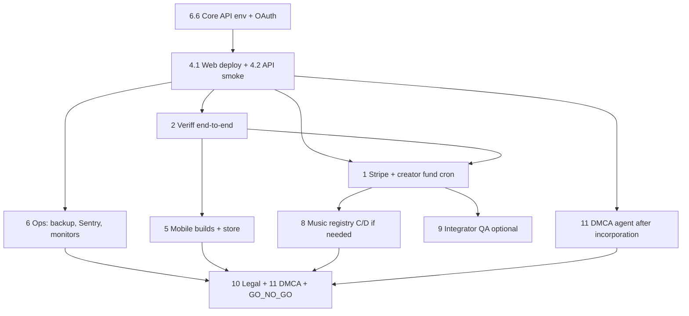

# Launch remaining work — master reference

**Last updated:** 2026-06-11 (includes §11 DMCA designated agent & workflow)  
**Purpose:** Single place to see what is still open before par Noir is **fully operational** (production payments, identity verification, mobile distribution, ops, and integrator readiness). Use this to slice work into sprints; tick items here or in the linked checklists as you complete them.

**Related (narrower scope):**

| Doc | Use when |
|-----|----------|
| [GO_NO_GO_LAUNCH.md](./GO_NO_GO_LAUNCH.md) | Final GA gate + sign-off table |
| [PRODUCTION_ENV_AUDIT.md](./PRODUCTION_ENV_AUDIT.md) | Env vars and security flags only |
| [OAUTH_AND_PRODUCTION_ROLLOUT_CHECKLIST.md](./OAUTH_AND_PRODUCTION_ROLLOUT_CHECKLIST.md) | OAuth refresh rotation and signing |
| [BACKUP_AND_RESTORE_RUNBOOK.md](./BACKUP_AND_RESTORE_RUNBOOK.md) | Postgres backup drill |
| [PRODUCTION_READINESS_PLAN.md](./PRODUCTION_READINESS_PLAN.md) | What engineering already shipped vs ops left |
| [docs/STATUS.md](../STATUS.md) | What is implemented today (by layer) |
| [docs/business/CREATOR_FUND_AND_SUBSCRIPTION_ECONOMICS.md](../business/CREATOR_FUND_AND_SUBSCRIPTION_ECONOMICS.md) | Creator fund policy + Stripe go-live checklist |
| [docs/MOBILE_READINESS_REPORT.md](../MOBILE_READINESS_REPORT.md) | Mobile security/scaling findings (Mar 2025) |
| [docs/developer/LAUNCH_QA_INTEGRATOR.md](../developer/LAUNCH_QA_INTEGRATOR.md) | L5 SDK / integrator QA |

---

## How to read this doc

- **Status:** `Not started` | `Partial` | `Ops only` (code exists; configure/test/deploy) | `Deferred` (intentionally out of v1)
- **Priority:** **P0** = blocks revenue or store submission; **P1** = required for confident GA; **P2** = polish, scale, or post-launch
- Each item includes **context**, **where in the repo**, and **done when** so you can write a sprint plan without re-reading the codebase.

---

## Executive summary

| Area | Code status | What’s left |
|------|-------------|-------------|
| Core product (L1–L4) | Largely built per [STATUS.md](../STATUS.md) | Configure prod env, finish payment/identity rails, mobile shells |
| Stripe (creator fund) | **Partial** — routes + ledger when keys set | Production account, Connect, webhooks, cron, E2E, legal |
| Veriff (identity) | **Partial** — session proxy + scaffold webhook | Webhook auth, DB sync, dashboard UX, payment step |
| Coinbase | **Partial** — feed creation + verification payment | Prod keys/webhooks or migrate verification billing |
| Web deploy | **Ops** — `./deploy.sh` → Firebase | Run on every release; align API commit |
| Mobile (Capacitor) | **Partial** — native projects exist | Build/sign, CORS smoke, store listings, TestFlight/Play |
| Production ops | **Templates only** | Backups, monitoring, OAuth hardening, sign-off |
| L5 integrators | **Partial** | Production QA + optional npm publish |
| Desktop app | **Separate product** | Electron dist if in scope |
| DMCA safe harbor | **Partial** — product workflow + policy page | Register designated agent (Copyright Office), ops runbook, policy address |

---

## 1. Stripe — monetization maintenance & creator payouts

**Priority:** P0 for creator fund  
**Policy:** [CREATOR_FUND_AND_SUBSCRIPTION_ECONOMICS.md](../business/CREATOR_FUND_AND_SUBSCRIPTION_ECONOMICS.md)  
**Status:** Partial — code returns `503` until configured; ledger and period close work without live Stripe for accrual math.

### Context

The **creator fund** is separate from “users pay to subscribe to a feed on par Noir.” It is:

- **Money in:** *Monetization maintenance* subscription (Stripe Billing/Checkout), with **balance-first renewal** (ledger debit first, Stripe only for shortfall).
- **Money out:** **Stripe Connect** only (US-only v1), **payee-initiated** payouts, 45-day hold, $10 minimum, typical UX cadence 1st/15th US Eastern.

Platform **viewer → creator feed subscriptions** are **disabled** (`410`); do not conflate with this work — see [FEEDS_AND_THIRD_PARTY_MONETIZATION.md](../business/FEEDS_AND_THIRD_PARTY_MONETIZATION.md).

### What exists today

| Piece | Location |
|-------|----------|
| Checkout, Customer Portal, Connect onboarding, webhooks | `api/src/server/modules/stripeMonetizationRoutes.ts`, `monetizationService.ts` |
| Dashboard Monetization tab | `apps/id-dashboard/src/components/monetization/MonetizationTab.tsx` |
| Creator fund tables + period close (DB-only) | `api/src/server/modules/creatorFundPeriodService.ts` |
| Connect payout request | `monetizationService.ts` (transfer after hold) |
| Env template | `api/.env.example` (`STRIPE_*`, `CREATOR_FUND_*`) |

### Still to do

#### 1.1 Stripe account & products (Ops) — P0

- [ ] Production Stripe account; **Connect application approved** (US payees v1).
- [ ] Create **Product + Price** for monetization maintenance; set `STRIPE_MONETIZATION_PRICE_ID`.
- [ ] Set on Railway (or API host):
  - `STRIPE_SECRET_KEY`
  - `STRIPE_WEBHOOK_SECRET`
  - `STRIPE_MONETIZATION_PRICE_ID`
  - Optional: `STRIPE_MONETIZATION_RENEWAL_CENTS` if Price unit amount cannot be read.
- [ ] Register webhook URL: `POST /api/monetization/stripe-webhook` (raw body — already exempt in `api/src/server.ts`).
- [ ] **Open decision:** Connect mode Express vs Standard vs Custom (economics doc § Open decisions).

**Done when:** Dashboard Monetization tab shows `stripeConfigured: true`; test checkout completes in production.

#### 1.2 Subscription lifecycle E2E (Eng + Ops) — P0

- [ ] New subscriber → active maintenance → `eligibleForFundAccrual` true when also verified.
- [ ] Renewal: full balance-only renewal (no card charge).
- [ ] Renewal: split (partial balance + Stripe shortfall).
- [ ] Cancel / failed payment / past_due handling.
- [ ] Chargeback or reversal → ledger reversal rows (policy in economics doc).

**Done when:** Each path verified against Stripe Dashboard + `monetization_subscriptions` / revenue event tables.

#### 1.3 Connect payouts (Eng + Ops) — P0

- [ ] Creator completes Connect onboarding from dashboard (`connectOnboarded`, `payouts_enabled`).
- [ ] Period close runs on schedule → allocations → hold elapses → payee initiates payout.
- [ ] $10 minimum and in-hold vs payable balances match UI copy.

**Done when:** Test payee receives a small production (or fully realistic staging) payout end-to-end.

#### 1.4 Creator fund period cron (Ops) — P0

- [ ] Set `CREATOR_FUND_CRON_SECRET` and `CREATOR_FUND_PERIOD_DAYS` (30 in prod; `1` only for local testing).
- [ ] Schedule caller (Railway cron, GitHub Action, or external) for `POST /api/creator-fund/periods/close` with `X-Cron-Secret`.
- [ ] Optional: `CREATOR_FUND_PERIOD_ATTESTATION_SECRET` or `CREATOR_FUND_PERIOD_KMS_KEY_VERSION` for signed period rows.
- [ ] Set `CREATOR_FUND_PAYOUT_HOLD_DAYS` (default 45) if non-default.

**Done when:** Closed periods appear in admin/export and drive allocation without manual SQL.

#### 1.5 Legal & finance (Non-code) — P0 before marketing payouts

- [ ] Counsel: Connect agreement, MoR, payout classification, US-only posture, escheatment.
- [ ] CPA: 1099 / reporting for balance vs card maintenance; **`G` net of Stripe processing fees** (see economics doc).
- [ ] Disable stablecoin payout UI unless Stripe program explicitly enabled for your platform.

---

## 2. Veriff — identity verification

**Priority:** P0 for verified creators, API key activation, creator fund 90/10 weighting  
**Status:** Partial — API session proxy exists; webhook and dashboard UX incomplete.

### Context

Verification is a **trust gate** ($5 one-time intent in product copy), not the same SKU as monetization maintenance. Engagement and creator fund use `verified_identities` (`is_active = TRUE`) — see `VerificationIntegrationService` and `engagementService.ts`.

Today the dashboard **Identity Verification** flow still:

1. Collects payment via **Coinbase Commerce** (crypto), not Stripe.
2. Shows **“Identity verification coming soon”** when `VITE_VERIFF_ENABLED` is not true.
3. Relies on client/demo paths in places (economics doc: remove demo-only gates before launch).

### What exists today

| Piece | Location |
|-------|----------|
| API Veriff session + webhook scaffold | `api/src/server/modules/verificationRoutes.ts` |
| Sync to `verified_identities` | `api/src/server/modules/verificationIntegrationService.ts` |
| Unauthenticated sync endpoint | `POST /api/verification/sync` in `api/src/server.ts` (~7861) — **must be secured for production** |
| Dashboard modal (Coinbase + Veriff steps) | `apps/id-dashboard/src/components/IdentityVerificationModal.tsx` |
| Client verification service | `apps/id-dashboard/src/services/identityVerificationService.ts` |
| Feature flags | `apps/id-dashboard/src/config/verification.ts` (`VITE_VERIFF_ENABLED`, `VITE_COINBASE_COMMERCE_ENABLED`) |
| Detailed product doc | `apps/id-dashboard/docs/IDENTITY_VERIFICATION.md` |

### Still to do

#### 2.1 Veriff production setup (Ops) — P0

- [ ] Veriff production API key; set on API: `VERIFF_API_KEY`, `VERIFF_ENABLED=true`.
- [ ] Set `VERIFF_CALLBACK_URL` or `API_PUBLIC_URL` so session callback points to `POST /api/verification/veriff/webhook`.
- [ ] Dashboard build: `VITE_VERIFF_ENABLED=true` (and retire duplicate `REACT_APP_VERIFF_*` in deploy env — see §7).

**Done when:** `POST /api/verification/veriff/session` returns a live Veriff URL in production.

#### 2.2 Webhook completion (Eng) — P0

Current webhook only logs and returns `{ ok: true }` — no signature check, no DB update.

- [ ] Implement Veriff **webhook signature validation** (secret from Veriff dashboard).
- [ ] On approved session: call `VerificationIntegrationService.syncVerificationStatus(identityId, verificationId, verifiedAt)` using `vendorData` / session metadata (identity id).
- [ ] Handle declined / expired / resubmission paths; optional `deactivateVerification`.
- [ ] Remove or protect `POST /api/verification/sync` (do not allow arbitrary clients to mark users verified).

**Done when:** Completing Veriff in staging writes `verified_identities` and `/api/monetization/status` shows `verified: true` without manual sync.

#### 2.3 Dashboard UX wiring (Eng) — P0

- [ ] Replace “coming soon” step with embedded or redirect Veriff flow using API session URL.
- [ ] After webhook, poll or push UI to confirmed state; surface verification expiry/re-verify policy.
- [ ] Ensure ZKP / verified data point flows align with server truth (not localStorage-only demo — see `VerificationPaymentHandler` references in economics doc).

**Done when:** New user can pay (if required) → complete Veriff → see verified status in dashboard and browser engagement weighting.

#### 2.4 Verification payment rail (Product + Eng) — P0

**Decision required:** Keep **Coinbase** for the $5 verification fee vs move to **Stripe Checkout** one-time Price.

| Option | Pros | Cons |
|--------|------|------|
| Coinbase (current UI) | Already in modal | Second payment vendor; crypto-only UX |
| Stripe one-time | Single vendor with maintenance | Separate Product id from maintenance SKU |

If Coinbase:

- [ ] Production `COINBASE_COMMERCE_API_KEY`, `COINBASE_WEBHOOK_SECRET` on API (`coinbaseWebhookHandler.ts`).
- [ ] Dashboard `VITE_COINBASE_COMMERCE_ENABLED=true`.
- [ ] Webhook confirms payment before Veriff step.

**Done when:** Payment confirmation is server-verified before Veriff session is issued.

---

## 3. Coinbase — feed creation & legacy checkouts

**Priority:** P1 (if you still sell paid feed *ownership* tier via Coinbase)  
**Status:** Partial — separate from creator fund `G`.

### Context

Coinbase webhooks today cover **feed creation** and related flows — **not** creator-fund maintenance. See [FEEDS_AND_THIRD_PARTY_MONETIZATION.md](../business/FEEDS_AND_THIRD_PARTY_MONETIZATION.md).

### Still to do

- [ ] Production Coinbase Commerce keys + webhook URL on API.
- [ ] Confirm which SKUs still use Coinbase vs should migrate to Stripe.
- [ ] Verify webhook signature in production (`api/src/server/modules/coinbaseWebhookHandler.ts`).

**Done when:** Feed creation payment path works in prod without manual intervention.

---

## 4. Releases & deployment

**Priority:** P0 for any ship  
**Status:** Web pipeline scripted; API and mobile are separate.

### 4.1 Web (Firebase) — Ops

**Hosts** (from root `firebase.json` / `.firebaserc`):

| Firebase target | App | Typical domain |
|-----------------|-----|----------------|
| `par-noir-dashboard` | id-dashboard | `pn.parnoir.com` |
| `browse` | aggregator-browser | `browse.parnoir.com` |
| `messaging` | aggregator-browser (`dist-messaging`) | `messaging.parnoir.com` |
| `prism` | prism | `prism.parnoir.com` |
| `licensing` | licensing-portal | licensing site |
| `developer` | developer-portal | `developers.parnoir.com` |

- [ ] Every production front-end build uses **`VITE_API_ENDPOINT`** (root `./deploy.sh` exports default `https://api.parnoir.com`).
- [ ] Per-app **`VITE_PN_CLIENT_ID`** at build time (`deploy.sh` sets browser vs prism vs developer vs licensing — do not leak one client id across apps).
- [ ] Run `./deploy.sh` after merges to `main` (or equivalent CI).
- [ ] Release notes / version discipline if you tag customer-facing releases.

**Done when:** All six sites serve the same API commit you tested.

### 4.2 API (Railway) — Ops

- [ ] Auto-deploy from `main` or manual deploy aligned with front-end.
- [ ] Complete [PRODUCTION_ENV_AUDIT.md](./PRODUCTION_ENV_AUDIT.md).
- [ ] Smoke: `cd api && API_BASE_URL=https://api.parnoir.com npm run smoke:health`.

**Done when:** `/health` and `/health/ready` green; OAuth login works against prod API.

### 4.3 Desktop (Electron) — P2 unless in v1 scope

**App:** `apps/desktop-dashboard` (`com.parnoir.desktop`) — VeraCrypt secure volume, **not** App Store.

- [ ] Cross-platform build/sign (`npm run dist`, `dist:win`, `dist:linux`) — see `TESTING_CROSS_PLATFORM.md`.
- [ ] Code signing / notarization (macOS), installer distribution.
- [ ] Release channel (website download vs store).

**Done when:** You have a signed artifact for your chosen platform(s).

### 4.4 npm SDK (L5 integrators) — P1 if third parties launch with you

- [ ] Complete [LAUNCH_QA_INTEGRATOR.md](../developer/LAUNCH_QA_INTEGRATOR.md).
- [ ] Publish `@par-noir/oauth-ui` then `@identity-protocol/identity-sdk` per `sdk/identity-sdk/PUBLISHING.md`.

---

## 5. Mobile — App Store & Play Store

**Priority:** P0 for native distribution  
**Status:** Capacitor shells exist; store submission not done.

### Capacitor apps

| App | Config path | App ID |
|-----|-------------|--------|
| Dashboard | `apps/id-dashboard/capacitor.config.json` | `com.parnoir.dashboard` |
| Browser | `apps/aggregator-browser/capacitor.config.json` | `com.parnoir.browser` |
| Messaging | `apps/aggregator-browser/capacitor-messaging/capacitor.config.json` | `com.parnoir.messaging` |
| Prism | `apps/prism/capacitor.config.json` | `com.parnoir.prism` |

Build messaging from aggregator: `npm run build:messaging` → `dist-messaging`.

### Still to do

#### 5.1 Engineering before store (Eng) — P0

- [ ] Production web build + `npx cap sync` per app; fix native splash/icons.
- [ ] **CORS smoke on real devices** — API includes `capacitor://localhost`, `ionic://localhost`, `https://localhost` in `DEFAULT_ORIGINS` (`api/src/server.ts`); confirm on hardware.
- [ ] Register **separate OAuth clients** per app; matching redirect URIs / custom URL schemes.
- [ ] Push notifications: configure **FCM** (`GOOGLE_APPLICATION_CREDENTIALS`, `pushFcm.ts`) if native push is required — registration exists in browser; delivery no-ops without FCM.
- [ ] Address open items from [MOBILE_READINESS_REPORT.md](../MOBILE_READINESS_REPORT.md) (pagination caps, REACT_APP cleanup, any remaining security findings — re-audit before submit).

**Done when:** Each app completes OAuth unlock, core journey, and API calls on TestFlight/internal track.

#### 5.2 Store submission (Ops + Product) — P0

Per app (×4):

- [ ] Apple Developer + Google Play accounts; bundle IDs match Capacitor.
- [ ] Privacy policy URL + support contact (required).
- [ ] Screenshots, descriptions, age rating, export compliance.
- [ ] **TestFlight / Play internal testing** passed for the build you promote.
- [ ] App Review notes (OAuth, encryption, UGC moderation via Prism/DMCA if asked).

**Done when:** Apps approved on production tracks (or phased rollout %).

#### 5.3 Web-only surfaces (no store)

Licensing portal and developer portal deploy via Firebase only — still need production QA and correct OAuth client ids, but **not** App/Play listings unless you add Capacitor later.

---

## 6. Production operations & security

**Priority:** P1 (P0 if you call it GA)  
**Status:** Engineering pass 1–2 shipped; execution open per [PRODUCTION_READINESS_PLAN.md](./PRODUCTION_READINESS_PLAN.md).

### 6.1 Data & availability — P1

- [ ] Postgres automated backups enabled on provider (Railway/etc.).
- [ ] **Restore drill** completed; fill table in [BACKUP_AND_RESTORE_RUNBOOK.md](./BACKUP_AND_RESTORE_RUNBOOK.md).
- [ ] `REDIS_URL` set when running **>1** API instance (shared API-key rate limits).

### 6.2 Observability — P1

- [ ] `SENTRY_DSN` on API; alert on 5xx and OAuth refresh failures.
- [ ] Optional `VITE_SENTRY_DSN` on aggregator-browser production build.
- [ ] External uptime on `/health` and `/health/ready`.
- [ ] Dashboards: latency, pool, 429 rate on host.

### 6.3 OAuth hardening — P1

Follow [OAUTH_AND_PRODUCTION_ROLLOUT_CHECKLIST.md](./OAUTH_AND_PRODUCTION_ROLLOUT_CHECKLIST.md):

- [ ] Staging: `PN_OAUTH_ENFORCE_REFRESH_ROTATION=true` → smoke browse, messaging, prism, developer portal.
- [ ] Production: same after staging OK.
- [ ] Lock signing: `PN_OAUTH_SECRET` (HS256) or RS256/KMS; stable `PN_OAUTH_ISSUER` / `PN_OAUTH_AUDIENCE`.

### 6.4 Realtime — P1

- [ ] `SOCKET_REQUIRE_AUTH=true` on production API (recommended in [STATUS.md](../STATUS.md)).

### 6.5 Admin & storage (when ready) — P2

- [ ] Admin: edge identity headers per [ADMIN_AUTHENTICATION.md](./ADMIN_AUTHENTICATION.md).
- [ ] Optional KMS: `STORAGE_CREDENTIALS_ENVELOPE_V2` + `STORAGE_CREDENTIALS_KMS_KEY` in staging then prod.

### 6.6 Core platform secrets — P0

Without these, apps do not work regardless of Stripe/Veriff:

- [ ] `DATABASE_URL`
- [ ] `PN_OAUTH_SECRET` (or RS256/KMS path)
- [ ] Google Drive OAuth: `GOOGLE_DRIVE_CLIENT_ID`, `GOOGLE_DRIVE_CLIENT_SECRET` (API + dashboard storage)
- [ ] `ALLOW_UNSAFE_DEV_ADMIN_BYPASS` **not** `true` in production

### 6.7 Sign-off — P1

- [ ] Complete [GO_NO_GO_LAUNCH.md](./GO_NO_GO_LAUNCH.md) engineering + product/ops table.

---

## 7. Code hygiene & mobile hardening (engineering backlog)

**Priority:** P1 before wide mobile rollout; P2 for web-only beta.

| Item | Context | Where |
|------|---------|-------|
| REACT_APP_* → VITE_* | id-dashboard still mixes env prefixes; breaks Vite deploy consistency | Grep `process.env.REACT_APP_` under `apps/id-dashboard/src` |
| Unbounded list queries | `limit: 999999` on connections/notifications — mobile OOM risk | `connectionsSheetsService.ts`, `notificationService.ts` |
| Verification sync auth | Open POST `/api/verification/sync` | `api/src/server.ts` |
| Veriff webhook | No signature validation yet | `verificationRoutes.ts` |
| Feed token endpoint | Historical report: decrypted pn name/passcode in API response — **verify fixed before launch** | `feedRoutes.ts` (audit) |
| PWA offline | Intentionally disabled (install-only) | `apps/id-dashboard/src/hooks/usePWA.ts` |
| Load testing | Not in repo yet | k6/Artillery on hot routes — optional P2 |

---

## 8. Music registry & licensing portal (creator fund dependency)

**Priority:** P1 for full creator fund + music pool splits  
**Status:** Phases A–B shipped; C–D partial per [STATUS.md](../STATUS.md).

### Context

Creator fund allocation uses **75/25** creator vs music pool when posts attach registry tracks. Licensing portal: authenticated track library + intake.

### Still to do

- [ ] Track registry phases **C–D**: on-content track proof, post-attach flows in browser edit/upload (verify prod E2E).
- [ ] Licensing portal: contract intake + authenticated catalog sync for rights holders receiving music-pool payouts.
- [ ] Connect onboarding for **track owners** via licensing portal (same Stripe Connect rail).

**Done when:** Post with registered track → period close → correct split in allocation export.

---

## 9. L5 integrator platform

**Priority:** P1 if external developers launch with GA  
**Status:** API + SDK exist; npm publish optional.

- [ ] Production OAuth silo E2E ([LAUNCH_QA_INTEGRATOR.md](../developer/LAUNCH_QA_INTEGRATOR.md)).
- [ ] Developer portal: client registration, webhooks, API keys in prod.
- [ ] SDK tests green; example app runs with production `VITE_PN_CLIENT_ID`.
- [ ] npm publish workflow if distributing outside monorepo.

---

## 10. Legal, compliance & trust (non-code)

**Priority:** P0 before paid features and store submission

- [ ] Privacy policy + terms of service (URLs used in store listings).
- [ ] Support email / help center.
- [ ] **DMCA designated agent + takedown ops** — full checklist in §11 (required for UGC platform safe harbor before wide GA).
- [ ] Age / NSFW: browser gating with age ZKP — confirm policy matches store age ratings.
- [ ] Creator fund: counsel + CPA per §1.5.

---

## 11. DMCA — designated agent & takedown workflow

**Priority:** P0 before wide public launch (UGC indexing / feeds)  
**Status:** Partial — API, Prism, and policy page exist; **Copyright Office registration and operational workflow not complete.**

### Context

par Noir is an **index and discovery layer** — it does **not** host user files (content stays in user storage, e.g. Google Drive). A “takedown” means **delisting from the par Noir index** (and related discovery surfaces), not deleting the file from the user’s Drive. That model is documented on the public DMCA policy page.

For **§ 512(c) safe harbor** in the U.S., you must register a **designated agent** with the **U.S. Copyright Office** and publish agent contact info on the site. Registration is tied to a **service provider identity** (your incorporated entity) and a **physical mailing address** — plan this **after incorporation** (same window as Stripe/Veriff), not before.

**External reference:** [Copyright Office DMCA designated agent registration](https://www.copyright.gov/dmca-directory/) (online filing; fee applies; renew/update when agent details change).

Optional: some companies use a **third-party DMCA agent service** to receive notices at a stable address; you still file with the Copyright Office using the agent’s details if you go that route.

### What exists today (product)

| Piece | Location / behavior |
|-------|---------------------|
| Public DMCA policy page | `apps/id-dashboard/src/pages/DmcaPolicy.tsx` — route `/dmca`; lists `dmca@parnoir.com`; **mailing address is still a placeholder** |
| Claimant takedown intake (API) | `POST /api/dmca/takedown` — public, no auth; stores `dmca_takedown_requests` |
| Admin: accept notice & delist | `POST /api/dmca/takedown/:id/process` — Prism admin only |
| Counter-notice | `POST /api/dmca/counter-notice`; restore after window via admin `process-restores` |
| Index-only takedown / restore | `api/src/server/modules/dmcaTakedownService.ts` |
| Pre-publish bot gate (Gemini sample check) | `api/src/server/modules/dmcaGate.ts` — flags → Prism queue |
| User copyright reports (browser) | `POST /api/reports` (`reportType: copyright`) → Prism queue |
| Human review app | `apps/prism` (`prism.parnoir.com`) — Rays review queue; admins process takedowns |
| Owner in-app notices | `contentNoticesService` — pending review, taken down, restored |
| Repeat infringer timeouts | `api/src/server/modules/repeatInfringerService.ts` |

**Gap:** There is **no public web form** for claimants yet — only the API endpoint and policy text. Notices may arrive via **email to `dmca@parnoir.com`** until you add a form or wire a landing page to `POST /api/dmca/takedown`.

### Still to do

#### 11.1 Register designated agent (Ops + Legal) — P0

**Blocked until incorporated** (need legal entity name and service provider address).

- [ ] Choose agent: **founder/officer** at company address **or** third-party DMCA agent vendor.
- [ ] File **designated agent registration** with the U.S. Copyright Office for the incorporated service provider (par Noir entity operating the platform).
- [ ] Ensure registration lists at least: **organization name**, **physical address**, **email** (`dmca@parnoir.com` or dedicated inbox), **phone** (if required by form).
- [ ] Pay filing fee and save confirmation; calendar **renewal/update** when address or agent changes.
- [ ] Confirm `dmca@parnoir.com` (or chosen alias) is a **monitored mailbox** with SLA (e.g. acknowledge within 24–48h, act on valid notices promptly).

**Done when:** Entity appears in the Copyright Office public directory and agent email receives test mail.

#### 11.2 Update public policy & store listings — P0

- [ ] Replace placeholder in `DmcaPolicy.tsx`: `[Designated agent physical address to be added]` with **registered agent mailing address** (must match Copyright Office filing).
- [ ] Link **DMCA policy** from footer (already on dashboard) and add same URL to **App Store / Play** metadata where “copyright / contact” is requested.
- [ ] Align privacy policy and terms with index-only takedown model (no hosting; delist only).

**Done when:** `/dmca` on production shows complete agent block; store reviewers can reach a live policy URL.

#### 11.3 Operational workflow (Ops) — P0

Document who does what when a notice arrives (internal runbook — can **draft now**, finalize after agent is live):

| Step | Action | Tool / endpoint |
|------|--------|-----------------|
| 1 | Notice received (email or API) | `dmca@parnoir.com` or `POST /api/dmca/takedown` |
| 2 | Validate § 512(c)(3) elements | Manual checklist (policy page lists required fields) |
| 3 | Resolve content | `infringing_content_ref` → file ID (`dmcaTakedownRequestsService.resolveInfringingRefToFileId`) |
| 4 | Execute delist | Admin `POST /api/dmca/takedown/:id/process` → `executeTakedown` |
| 5 | Notify owner | `content_notices` (owner sees in dashboard) |
| 6 | Counter-notice | Owner `POST /api/dmca/counter-notice`; forward to claimant; wait 10–14 business days |
| 7 | Restore or keep delisted | Admin `process-restores` if no court action |
| 8 | Repeat infringer | `repeatInfringerService` after upheld takedowns / Prism denials |

- [ ] Assign **DMCA ops owner** (person or role) and **Prism admin** pn identifiers (`prismAdminService`).
- [ ] Staff or recruit **Rays** for Prism queue if bot + user report volume needs human review ([prism.parnoir.com](https://prism.parnoir.com)).
- [ ] Run **tabletop exercise**: synthetic takedown → process → owner counter-notice → restore path in staging/production.
- [ ] Optional eng: **public takedown form** (dashboard or static page posting to `POST /api/dmca/takedown`) so claimants don’t rely on email alone.

**Done when:** One end-to-end drill completed and documented; inbox and admin roles assigned.

#### 11.4 Technical readiness (Eng + Ops) — P1

- [ ] **Gemini / DMCA gate:** ensure `GEMINI_*` (or equivalent) configured if bot gate should run in production; set `DMCA_GATE_FAIL_MODE` (`open` vs `closed`) per risk appetite (`dmcaGate.ts`).
- [ ] Prism admins configured on production API.
- [ ] Copyright reports from browser → queue → Ray decision → takedown path tested ([STATUS.md](../STATUS.md)).

**Done when:** Flagged upload or user report flows to Prism and can result in delist without manual DB edits.

#### 11.5 Relationship to incorporation timeline

| When | DMCA work |
|------|-----------|
| **Now (pre-incorporation)** | Draft ops runbook; ensure Prism/Ray program plan; verify API paths in staging; draft policy text except address |
| **After incorporation** | File Copyright Office registration; fill mailing address on `/dmca`; turn on monitored `dmca@` inbox |
| **Before store GA** | Policy URL live; repeat infringer policy understood; ops owner named |

**Not a substitute for legal advice:** Have counsel review policy, agent registration, and counter-notice timing for your entity.

---

## 12. Intentionally deferred (do not block v1 unless scope changes)

These are **policy or backlog**, not accidental gaps:

| Topic | Why deferred | Doc |
|-------|--------------|-----|
| Platform paid **feed subscriptions** (viewer pays creator on par Noir) | Returns `410`; MoR liability avoided | [FEEDS_AND_THIRD_PARTY_MONETIZATION.md](../business/FEEDS_AND_THIRD_PARTY_MONETIZATION.md) |
| Creator-owned paywall connectors | Phase 2 design only | Same |
| Gemini AI moderation | Planning / IMPLEMENTATION_PLAN | `IMPLEMENTATION_PLAN.md` |
| FEED_SYSTEM production plan phases | Large checklist mostly unchecked | `FEED_SYSTEM_PRODUCTION_PLAN.md` |
| Self-hosted Tier 3 feeds / plugin marketplace | Phase 4+ in `plan` | Root `plan` file |
| PWA offline / service worker | Install-only by design | MOBILE_READINESS_REPORT §2.3 |

---

## Suggested work order (planning template)

Use as a default sequencing; adjust if your GA definition is “mobile-only” or “creators-only.”



**Phase A — Foundation (1–2 weeks)**  
Core secrets, OAuth checklist staging, backup drill, smoke tests, web deploy pipeline verified.

**Phase B — Trust & money (2–4 weeks)**  
Veriff webhook + dashboard; verification payment decision; Stripe Connect + maintenance; period cron; payout E2E.

**Phase C — Distribution (2–4 weeks parallel)**  
Capacitor builds, TestFlight/Play internal, store assets, FCM if needed.

**Phase D — GA gate**  
Copyright Office DMCA agent registered; policy page complete; takedown ops runbook; GO_NO_GO sign-off; legal; optional integrator npm publish; desktop if in scope.

---

## Quick env reference (payments & identity)

### API (Railway) — Stripe / creator fund

```bash
STRIPE_SECRET_KEY=
STRIPE_WEBHOOK_SECRET=
STRIPE_MONETIZATION_PRICE_ID=
# STRIPE_MONETIZATION_RENEWAL_CENTS=
CREATOR_FUND_CRON_SECRET=
# CREATOR_FUND_PERIOD_DAYS=30
# CREATOR_FUND_PAYOUT_HOLD_DAYS=45
```

### API — Veriff

```bash
VERIFF_API_KEY=
VERIFF_ENABLED=true
# VERIFF_CALLBACK_URL= or API_PUBLIC_URL=
```

### API — Coinbase (if retained)

```bash
COINBASE_COMMERCE_API_KEY=
COINBASE_WEBHOOK_SECRET=
```

### Dashboard build (Vite)

```bash
VITE_API_ENDPOINT=https://api.parnoir.com
VITE_VERIFF_ENABLED=true
VITE_COINBASE_COMMERCE_ENABLED=true  # if keeping Coinbase verification payment
```

---

## Maintaining this doc

When you ship a major milestone:

1. Update **Executive summary** and tick boxes.
2. Point to the commit or PR in the item’s “Done when” note if helpful.
3. Keep [STATUS.md](../STATUS.md) in sync for “what works today” vs this file for “what’s left.”
